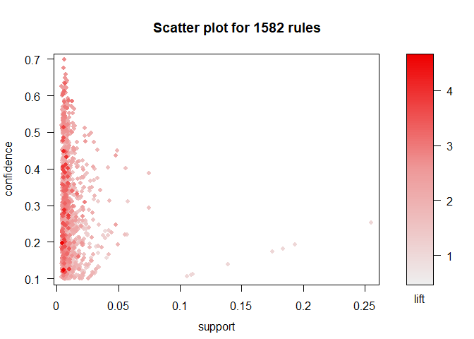
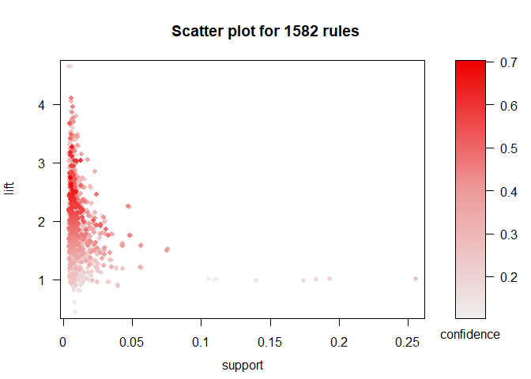
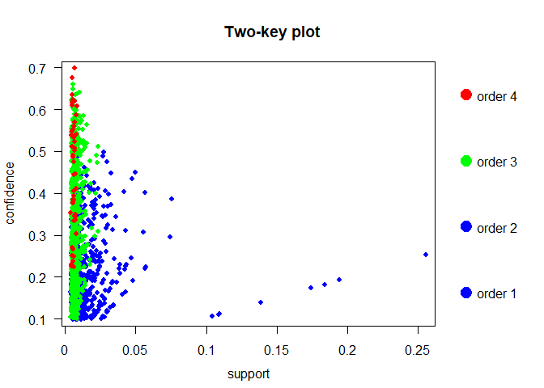
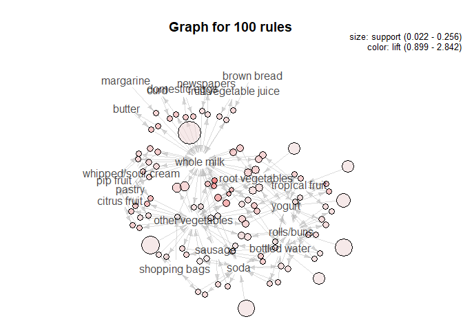
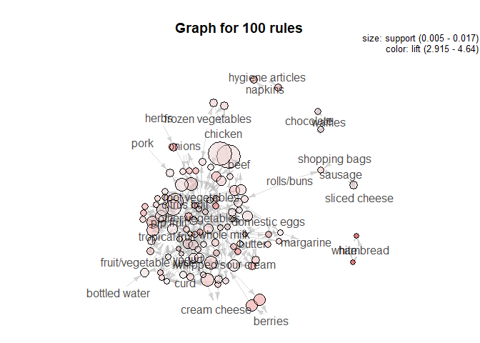

PM-Exam-2
================
Javeria Rangoonwala

    ## -- Attaching packages ----------------------------------------------- tidyverse 1.2.1 --

    ## v ggplot2 3.2.0     v purrr   0.3.2
    ## v tibble  2.1.3     v dplyr   0.8.3
    ## v tidyr   0.8.3     v stringr 1.4.0
    ## v readr   1.3.1     v forcats 0.4.0

    ## -- Conflicts -------------------------------------------------- tidyverse_conflicts() --
    ## x dplyr::filter() masks stats::filter()
    ## x dplyr::lag()    masks stats::lag()

    ## Loading required package: Matrix

    ## 
    ## Attaching package: 'Matrix'

    ## The following object is masked from 'package:tidyr':
    ## 
    ##     expand

    ## 
    ## Attaching package: 'arules'

    ## The following object is masked from 'package:dplyr':
    ## 
    ##     recode

    ## The following objects are masked from 'package:base':
    ## 
    ##     abbreviate, write

    ## Loading required package: grid

    ## Registered S3 method overwritten by 'seriation':
    ##   method         from 
    ##   reorder.hclust gclus

We read in the groceries data set, separating it by commas and removing
duplicates. Each row in this dataset is considered a
basket

``` r
groceries <- read.transactions("groceries.txt", format = "basket", sep=",", rm.duplicates=TRUE)
```

A basic summary of the dataset is provided below.

``` r
str(groceries)
```

    ## Formal class 'transactions' [package "arules"] with 3 slots
    ##   ..@ data       :Formal class 'ngCMatrix' [package "Matrix"] with 5 slots
    ##   .. .. ..@ i       : int [1:43367] 29 88 118 132 33 157 167 166 38 91 ...
    ##   .. .. ..@ p       : int [1:9836] 0 4 7 8 12 16 21 22 27 28 ...
    ##   .. .. ..@ Dim     : int [1:2] 169 9835
    ##   .. .. ..@ Dimnames:List of 2
    ##   .. .. .. ..$ : NULL
    ##   .. .. .. ..$ : NULL
    ##   .. .. ..@ factors : list()
    ##   ..@ itemInfo   :'data.frame':  169 obs. of  1 variable:
    ##   .. ..$ labels: chr [1:169] "abrasive cleaner" "artif. sweetener" "baby cosmetics" "baby food" ...
    ##   ..@ itemsetInfo:'data.frame':  0 obs. of  0 variables

``` r
summary(groceries)
```

    ## transactions as itemMatrix in sparse format with
    ##  9835 rows (elements/itemsets/transactions) and
    ##  169 columns (items) and a density of 0.02609146 
    ## 
    ## most frequent items:
    ##       whole milk other vegetables       rolls/buns             soda 
    ##             2513             1903             1809             1715 
    ##           yogurt          (Other) 
    ##             1372            34055 
    ## 
    ## element (itemset/transaction) length distribution:
    ## sizes
    ##    1    2    3    4    5    6    7    8    9   10   11   12   13   14   15 
    ## 2159 1643 1299 1005  855  645  545  438  350  246  182  117   78   77   55 
    ##   16   17   18   19   20   21   22   23   24   26   27   28   29   32 
    ##   46   29   14   14    9   11    4    6    1    1    1    1    3    1 
    ## 
    ##    Min. 1st Qu.  Median    Mean 3rd Qu.    Max. 
    ##   1.000   2.000   3.000   4.409   6.000  32.000 
    ## 
    ## includes extended item information - examples:
    ##             labels
    ## 1 abrasive cleaner
    ## 2 artif. sweetener
    ## 3   baby cosmetics

We created a matrix of groceries

``` r
grocery_matrix <- as(groceries, 'transactions')
```

The Apriori algorithm is based on the understanding that if an itemset
has associations, then all of its subsets must also have associations.
We choose a relatively restricted criteria, to observe the most common
associations. Here we can see that milk and different kinds of
vegetables are the most
common

``` r
groceryrules = apriori(grocery_matrix, parameter=list(support=.002, confidence=.05, maxlen=5))
```

    ## Apriori
    ## 
    ## Parameter specification:
    ##  confidence minval smax arem  aval originalSupport maxtime support minlen
    ##        0.05    0.1    1 none FALSE            TRUE       5   0.002      1
    ##  maxlen target   ext
    ##       5  rules FALSE
    ## 
    ## Algorithmic control:
    ##  filter tree heap memopt load sort verbose
    ##     0.1 TRUE TRUE  FALSE TRUE    2    TRUE
    ## 
    ## Absolute minimum support count: 19 
    ## 
    ## set item appearances ...[0 item(s)] done [0.00s].
    ## set transactions ...[169 item(s), 9835 transaction(s)] done [0.00s].
    ## sorting and recoding items ... [147 item(s)] done [0.00s].
    ## creating transaction tree ... done [0.00s].
    ## checking subsets of size 1 2 3 4 5

    ## Warning in apriori(grocery_matrix, parameter = list(support = 0.002,
    ## confidence = 0.05, : Mining stopped (maxlen reached). Only patterns up to a
    ## length of 5 returned!

    ##  done [0.01s].
    ## writing ... [10124 rule(s)] done [0.00s].
    ## creating S4 object  ... done [0.00s].

``` r
#head(inspect(groceryrules))
```

We increased the support and confidence to account for items that are
not purchased. As expected, we can see a wide variety of associations
here

``` r
groceryrules = apriori(grocery_matrix, parameter=list(support=.005, confidence=.1, maxlen=5))
```

    ## Apriori
    ## 
    ## Parameter specification:
    ##  confidence minval smax arem  aval originalSupport maxtime support minlen
    ##         0.1    0.1    1 none FALSE            TRUE       5   0.005      1
    ##  maxlen target   ext
    ##       5  rules FALSE
    ## 
    ## Algorithmic control:
    ##  filter tree heap memopt load sort verbose
    ##     0.1 TRUE TRUE  FALSE TRUE    2    TRUE
    ## 
    ## Absolute minimum support count: 49 
    ## 
    ## set item appearances ...[0 item(s)] done [0.00s].
    ## set transactions ...[169 item(s), 9835 transaction(s)] done [0.00s].
    ## sorting and recoding items ... [120 item(s)] done [0.00s].
    ## creating transaction tree ... done [0.00s].
    ## checking subsets of size 1 2 3 4 done [0.00s].
    ## writing ... [1582 rule(s)] done [0.00s].
    ## creating S4 object  ... done [0.00s].

Now we make subsets based on a confidence and lift that are not too low
nor too high. Then

``` r
inspect(subset(groceryrules, subset=lift > 5))
inspect(subset(groceryrules, subset=confidence > 0.6))
```

    ##      lhs                        rhs                    support confidence     lift count
    ## [1]  {onions,                                                                           
    ##       root vegetables}       => {other vegetables} 0.005693950  0.6021505 3.112008    56
    ## [2]  {curd,                                                                             
    ##       tropical fruit}        => {whole milk}       0.006507372  0.6336634 2.479936    64
    ## [3]  {domestic eggs,                                                                    
    ##       margarine}             => {whole milk}       0.005185562  0.6219512 2.434099    51
    ## [4]  {butter,                                                                           
    ##       domestic eggs}         => {whole milk}       0.005998983  0.6210526 2.430582    59
    ## [5]  {butter,                                                                           
    ##       whipped/sour cream}    => {whole milk}       0.006710727  0.6600000 2.583008    66
    ## [6]  {bottled water,                                                                    
    ##       butter}                => {whole milk}       0.005388917  0.6022727 2.357084    53
    ## [7]  {butter,                                                                           
    ##       tropical fruit}        => {whole milk}       0.006202339  0.6224490 2.436047    61
    ## [8]  {butter,                                                                           
    ##       root vegetables}       => {whole milk}       0.008235892  0.6377953 2.496107    81
    ## [9]  {butter,                                                                           
    ##       yogurt}                => {whole milk}       0.009354347  0.6388889 2.500387    92
    ## [10] {domestic eggs,                                                                    
    ##       pip fruit}             => {whole milk}       0.005388917  0.6235294 2.440275    53
    ## [11] {domestic eggs,                                                                    
    ##       tropical fruit}        => {whole milk}       0.006914082  0.6071429 2.376144    68
    ## [12] {pip fruit,                                                                        
    ##       whipped/sour cream}    => {other vegetables} 0.005592272  0.6043956 3.123610    55
    ## [13] {pip fruit,                                                                        
    ##       whipped/sour cream}    => {whole milk}       0.005998983  0.6483516 2.537421    59
    ## [14] {fruit/vegetable juice,                                                            
    ##       other vegetables,                                                                 
    ##       yogurt}                => {whole milk}       0.005083884  0.6172840 2.415833    50
    ## [15] {other vegetables,                                                                 
    ##       root vegetables,                                                                  
    ##       whipped/sour cream}    => {whole milk}       0.005185562  0.6071429 2.376144    51
    ## [16] {other vegetables,                                                                 
    ##       pip fruit,                                                                        
    ##       root vegetables}       => {whole milk}       0.005490595  0.6750000 2.641713    54
    ## [17] {pip fruit,                                                                        
    ##       root vegetables,                                                                  
    ##       whole milk}            => {other vegetables} 0.005490595  0.6136364 3.171368    54
    ## [18] {other vegetables,                                                                 
    ##       pip fruit,                                                                        
    ##       yogurt}                => {whole milk}       0.005083884  0.6250000 2.446031    50
    ## [19] {citrus fruit,                                                                     
    ##       root vegetables,                                                                  
    ##       whole milk}            => {other vegetables} 0.005795628  0.6333333 3.273165    57
    ## [20] {root vegetables,                                                                  
    ##       tropical fruit,                                                                   
    ##       yogurt}                => {whole milk}       0.005693950  0.7000000 2.739554    56
    ## [21] {other vegetables,                                                                 
    ##       tropical fruit,                                                                   
    ##       yogurt}                => {whole milk}       0.007625826  0.6198347 2.425816    75
    ## [22] {other vegetables,                                                                 
    ##       root vegetables,                                                                  
    ##       yogurt}                => {whole milk}       0.007829181  0.6062992 2.372842    77

``` r
inspect(subset(groceryrules, subset=lift > 10 & confidence > 0.5))
```

We plot support vs confidence for groceryrules. Most of the rules are
concentrated below confidence of 0.6 whereas most of the support is less
than 0.05, meaning that items in Y appear mostly less than 70% of time.
The same can be seen in the graph of lift vs support. Lift is mostly
less than 2 for confidence of 70% or
    less

    ## To reduce overplotting, jitter is added! Use jitter = 0 to prevent jitter.

<!-- -->

``` r
plot(groceryrules, measure = c("support", "lift"), shading = "confidence")
```

    ## To reduce overplotting, jitter is added! Use jitter = 0 to prevent jitter.

<!-- -->

“two key” plot to show (order) of item set represented by different
colors. Order 1 and Order 2 have comparatively greater support and lower
confidence as opposed to other
    orders.

``` r
plot(groceryrules, method='two-key plot')
```

    ## To reduce overplotting, jitter is added! Use jitter = 0 to prevent jitter.

<!-- -->

These are the subsets that are driven by
    plot

``` r
inspect(subset(groceryrules, support > 0.035))
```

    ##      lhs                   rhs                support    confidence
    ## [1]  {}                 => {bottled water}    0.11052364 0.1105236 
    ## [2]  {}                 => {tropical fruit}   0.10493137 0.1049314 
    ## [3]  {}                 => {root vegetables}  0.10899847 0.1089985 
    ## [4]  {}                 => {soda}             0.17437722 0.1743772 
    ## [5]  {}                 => {yogurt}           0.13950178 0.1395018 
    ## [6]  {}                 => {rolls/buns}       0.18393493 0.1839349 
    ## [7]  {}                 => {other vegetables} 0.19349263 0.1934926 
    ## [8]  {}                 => {whole milk}       0.25551601 0.2555160 
    ## [9]  {tropical fruit}   => {other vegetables} 0.03589222 0.3420543 
    ## [10] {other vegetables} => {tropical fruit}   0.03589222 0.1854966 
    ## [11] {tropical fruit}   => {whole milk}       0.04229792 0.4031008 
    ## [12] {whole milk}       => {tropical fruit}   0.04229792 0.1655392 
    ## [13] {root vegetables}  => {other vegetables} 0.04738180 0.4347015 
    ## [14] {other vegetables} => {root vegetables}  0.04738180 0.2448765 
    ## [15] {root vegetables}  => {whole milk}       0.04890696 0.4486940 
    ## [16] {whole milk}       => {root vegetables}  0.04890696 0.1914047 
    ## [17] {soda}             => {rolls/buns}       0.03833249 0.2198251 
    ## [18] {rolls/buns}       => {soda}             0.03833249 0.2084024 
    ## [19] {soda}             => {whole milk}       0.04006101 0.2297376 
    ## [20] {whole milk}       => {soda}             0.04006101 0.1567847 
    ## [21] {yogurt}           => {other vegetables} 0.04341637 0.3112245 
    ## [22] {other vegetables} => {yogurt}           0.04341637 0.2243826 
    ## [23] {yogurt}           => {whole milk}       0.05602440 0.4016035 
    ## [24] {whole milk}       => {yogurt}           0.05602440 0.2192598 
    ## [25] {rolls/buns}       => {other vegetables} 0.04260295 0.2316197 
    ## [26] {other vegetables} => {rolls/buns}       0.04260295 0.2201787 
    ## [27] {rolls/buns}       => {whole milk}       0.05663447 0.3079049 
    ## [28] {whole milk}       => {rolls/buns}       0.05663447 0.2216474 
    ## [29] {other vegetables} => {whole milk}       0.07483477 0.3867578 
    ## [30] {whole milk}       => {other vegetables} 0.07483477 0.2928770 
    ##      lift      count
    ## [1]  1.0000000 1087 
    ## [2]  1.0000000 1032 
    ## [3]  1.0000000 1072 
    ## [4]  1.0000000 1715 
    ## [5]  1.0000000 1372 
    ## [6]  1.0000000 1809 
    ## [7]  1.0000000 1903 
    ## [8]  1.0000000 2513 
    ## [9]  1.7677896  353 
    ## [10] 1.7677896  353 
    ## [11] 1.5775950  416 
    ## [12] 1.5775950  416 
    ## [13] 2.2466049  466 
    ## [14] 2.2466049  466 
    ## [15] 1.7560310  481 
    ## [16] 1.7560310  481 
    ## [17] 1.1951242  377 
    ## [18] 1.1951242  377 
    ## [19] 0.8991124  394 
    ## [20] 0.8991124  394 
    ## [21] 1.6084566  427 
    ## [22] 1.6084566  427 
    ## [23] 1.5717351  551 
    ## [24] 1.5717351  551 
    ## [25] 1.1970465  419 
    ## [26] 1.1970465  419 
    ## [27] 1.2050318  557 
    ## [28] 1.2050318  557 
    ## [29] 1.5136341  736 
    ## [30] 1.5136341  736

``` r
inspect(subset(groceryrules, confidence > 0.7))
```

Now we visualise these subsets. The datset is in clusters when the
support is high and when the support is low, data set appears to be
spread out

``` r
sub1 = subset(groceryrules, subset=confidence > 0.01 & support > 0.005)
summary(sub1)
```

    ## set of 1582 rules
    ## 
    ## rule length distribution (lhs + rhs):sizes
    ##   1   2   3   4 
    ##   8 755 771  48 
    ## 
    ##    Min. 1st Qu.  Median    Mean 3rd Qu.    Max. 
    ##   1.000   2.000   3.000   2.543   3.000   4.000 
    ## 
    ## summary of quality measures:
    ##     support           confidence          lift            count       
    ##  Min.   :0.005084   Min.   :0.1000   Min.   :0.4457   Min.   :  50.0  
    ##  1st Qu.:0.005897   1st Qu.:0.1454   1st Qu.:1.4732   1st Qu.:  58.0  
    ##  Median :0.007321   Median :0.2189   Median :1.8174   Median :  72.0  
    ##  Mean   :0.010537   Mean   :0.2557   Mean   :1.9028   Mean   : 103.6  
    ##  3rd Qu.:0.010371   3rd Qu.:0.3315   3rd Qu.:2.2444   3rd Qu.: 102.0  
    ##  Max.   :0.255516   Max.   :0.7000   Max.   :4.6399   Max.   :2513.0  
    ## 
    ## mining info:
    ##            data ntransactions support confidence
    ##  grocery_matrix          9835   0.005        0.1

``` r
plot(sub1, method='graph')
```

    ## Warning: plot: Too many rules supplied. Only plotting the best 100 rules
    ## using 'support' (change control parameter max if needed)

<!-- -->

``` r
plot(head(sub1, 100, by='lift'), method='graph')
```

<!-- -->
