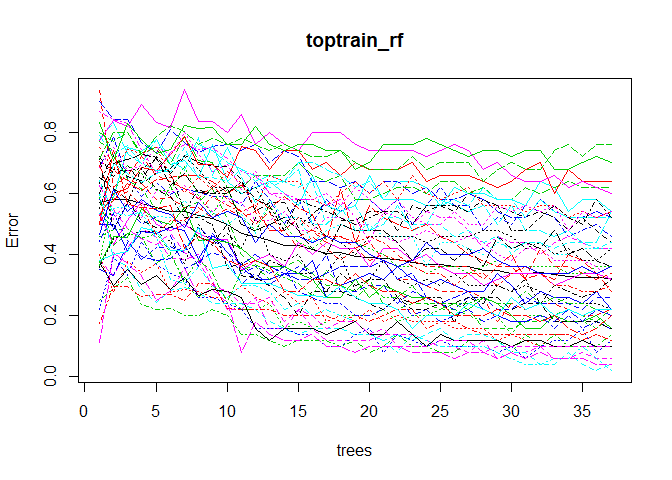

Author Attribution
================

``` r
## The tm library and related plugins comprise R's most popular text-mining stack.
## See http://cran.r-project.org/web/packages/tm/vignettes/tm.pdf
library(tm) 
```

    ## Loading required package: NLP

``` r
library(magrittr)
library(slam)
library(proxy)
```

    ## 
    ## Attaching package: 'proxy'

    ## The following objects are masked from 'package:stats':
    ## 
    ##     as.dist, dist

    ## The following object is masked from 'package:base':
    ## 
    ##     as.matrix

``` r
library(tidytext)
library(textstem)
```

    ## Loading required package: koRpus.lang.en

    ## Loading required package: koRpus

    ## Loading required package: sylly

    ## For information on available language packages for 'koRpus', run
    ## 
    ##   available.koRpus.lang()
    ## 
    ## and see ?install.koRpus.lang()

``` r
## tm has many "reader" functions.  Each one has
## arguments elem, language, id
## (see ?readPlain, ?readPDF, ?readXML, etc)
## This wraps another function around readPlain to read
## plain text documents in English.
readerPlain = function(fname){
                readPlain(elem=list(content=readLines(fname)), 
                            id=fname, language='en') }
```

Pre-Processing Train Data :

We take all the files to be used for training and store their names in
‘file\_list’

``` r
## "globbing" = expanding wild cards in filename paths
file_list = Sys.glob('data/ReutersC50/C50train/*/*.txt')
raw.data = lapply(file_list, readerPlain) 

# The file names are ugly...
#file_list
```

Out train data does not have a column for the response variable (in this
case, the name of the author). To extract the author name, we use the
file names.

``` r
# Function to split the path name by '/'
extract_author <- function(x) {
  strsplit(x, "/")
}
```

``` r
#Make a dataframe with the author names of each document
df = as.data.frame(lapply(extract_author(file_list), function(x) x[length(x) - 1] ))
author <- t(df)
rownames(author)<-seq(1,2500)
#author
```

We now clean up the file names

``` r
# Clean up the file names
# This uses the piping operator from magrittr
mynames = file_list %>%
    { strsplit(., '/', fixed=TRUE) } %>%
    { lapply(., tail, n=2) } %>%
    { lapply(., paste0, collapse = '') } %>%
    unlist
    
# Rename the articles
#mynames
names(raw.data) = mynames
```

Cleaning of Data :

``` r
## once you have documents in a vector, you 
## create a text mining 'corpus' with: 
documents_raw = Corpus(VectorSource(raw.data))

## Some pre-processing/tokenization steps.
## tm_map just maps some function to every document in the corpus
my_documents = documents_raw
my_documents = tm_map(my_documents, content_transformer(tolower)) # make everything lowercase
```

    ## Warning in tm_map.SimpleCorpus(my_documents, content_transformer(tolower)):
    ## transformation drops documents

``` r
my_documents = tm_map(my_documents, content_transformer(removeNumbers)) # remove numbers
```

    ## Warning in tm_map.SimpleCorpus(my_documents,
    ## content_transformer(removeNumbers)): transformation drops documents

``` r
my_documents = tm_map(my_documents, content_transformer(removePunctuation)) # remove punctuation
```

    ## Warning in tm_map.SimpleCorpus(my_documents,
    ## content_transformer(removePunctuation)): transformation drops documents

``` r
my_documents = tm_map(my_documents, content_transformer(stripWhitespace)) ## remove excess white-space
```

    ## Warning in tm_map.SimpleCorpus(my_documents,
    ## content_transformer(stripWhitespace)): transformation drops documents

``` r
my_documents = tm_map(my_documents, content_transformer(removeWords), stopwords("en"))
```

    ## Warning in tm_map.SimpleCorpus(my_documents,
    ## content_transformer(removeWords), : transformation drops documents

``` r
my_documents = tm_map(my_documents, content_transformer(stemDocument))
```

    ## Warning in tm_map.SimpleCorpus(my_documents,
    ## content_transformer(stemDocument)): transformation drops documents

Converting to sparse matrix :

``` r
## create a doc-term-matrix
DTM_raw = DocumentTermMatrix(my_documents)
DTM_raw # some basic summary statistics
```

    ## <<DocumentTermMatrix (documents: 2500, terms: 22479)>>
    ## Non-/sparse entries: 496196/55701304
    ## Sparsity           : 99%
    ## Maximal term length: 44
    ## Weighting          : term frequency (tf)

``` r
class(DTM_raw)  # a special kind of sparse matrix format
```

    ## [1] "DocumentTermMatrix"    "simple_triplet_matrix"

``` r
## You can inspect its entries...
#inspect(DTM_raw[1:10,1:20])
```

``` r
## Finally, drop those terms that only occur in one or two documents
## This is a common step: the noise of the "long tail" (rare terms)
##  can be huge, and there is nothing to learn if a term occured once.
## Below removes those terms that have count 0 in >97% of docs.  
DTM_raw = removeSparseTerms(DTM_raw, 0.97)
DTM_raw 
```

    ## <<DocumentTermMatrix (documents: 2500, terms: 1264)>>
    ## Non-/sparse entries: 360611/2799389
    ## Sparsity           : 89%
    ## Maximal term length: 13
    ## Weighting          : term frequency (tf)

We use TF-IDF values to build our features

``` r
# construct TF IDF weights
tfidf_raw = weightTfIdf(DTM_raw)
tfidf_raw
```

    ## <<DocumentTermMatrix (documents: 2500, terms: 1264)>>
    ## Non-/sparse entries: 320611/2839389
    ## Sparsity           : 90%
    ## Maximal term length: 13
    ## Weighting          : term frequency - inverse document frequency (normalized) (tf-idf)

``` r
train.data <- data.frame(as.matrix(tfidf_raw), stringsAsFactors=FALSE)

#Merge with author names
train.data <- merge(train.data,author,by =0)
train.data$V1 <- as.factor(train.data$V1)
#rev(names(train.data))[1]
#typeof(train.data['V1'])
```

Pre-processing on Test data:

We repeat the same procedure as above to get the test data

``` r
## "globbing" = expanding wild cards in filename paths
file_list = Sys.glob('data/ReutersC50/C50test/*/*.txt')
raw.data = lapply(file_list, readerPlain) 

# The file names are ugly...
#file_list
```

``` r
df = as.data.frame(lapply(extract_author(file_list), function(x) x[length(x) - 1] ))
author <- t(df)
rownames(author)<-seq(1,2500)
#author
```

``` r
# Clean up the file names
# This uses the piping operator from magrittr
mynames = file_list %>%
    { strsplit(., '/', fixed=TRUE) } %>%
    { lapply(., tail, n=2) } %>%
    { lapply(., paste0, collapse = '') } %>%
    unlist
    
# Rename the articles
#mynames
names(raw.data) = mynames
```

``` r
## once you have documents in a vector, you 
## create a text mining 'corpus' with: 
documents_raw = Corpus(VectorSource(raw.data))

## Some pre-processing/tokenization steps.
## tm_map just maps some function to every document in the corpus
my_documents = documents_raw
my_documents = tm_map(my_documents, content_transformer(tolower)) # make everything lowercase
```

    ## Warning in tm_map.SimpleCorpus(my_documents, content_transformer(tolower)):
    ## transformation drops documents

``` r
my_documents = tm_map(my_documents, content_transformer(removeNumbers)) # remove numbers
```

    ## Warning in tm_map.SimpleCorpus(my_documents,
    ## content_transformer(removeNumbers)): transformation drops documents

``` r
my_documents = tm_map(my_documents, content_transformer(removePunctuation)) # remove punctuation
```

    ## Warning in tm_map.SimpleCorpus(my_documents,
    ## content_transformer(removePunctuation)): transformation drops documents

``` r
my_documents = tm_map(my_documents, content_transformer(stripWhitespace)) ## remove excess white-space
```

    ## Warning in tm_map.SimpleCorpus(my_documents,
    ## content_transformer(stripWhitespace)): transformation drops documents

``` r
my_documents = tm_map(my_documents, content_transformer(removeWords), stopwords("en"))
```

    ## Warning in tm_map.SimpleCorpus(my_documents,
    ## content_transformer(removeWords), : transformation drops documents

``` r
my_documents = tm_map(my_documents, content_transformer(stemDocument))
```

    ## Warning in tm_map.SimpleCorpus(my_documents,
    ## content_transformer(stemDocument)): transformation drops documents

``` r
## create a doc-term-matrix
DTM_raw = DocumentTermMatrix(my_documents)
DTM_raw # some basic summary statistics
```

    ## <<DocumentTermMatrix (documents: 2500, terms: 22987)>>
    ## Non-/sparse entries: 502733/56964767
    ## Sparsity           : 99%
    ## Maximal term length: 45
    ## Weighting          : term frequency (tf)

``` r
class(DTM_raw)  # a special kind of sparse matrix format
```

    ## [1] "DocumentTermMatrix"    "simple_triplet_matrix"

``` r
## You can inspect its entries...
#inspect(DTM_raw[1:10,1:20])
```

``` r
## Finally, drop those terms that only occur in one or two documents
## This is a common step: the noise of the "long tail" (rare terms)
##  can be huge, and there is nothing to learn if a term occured once.
## Below removes those terms that have count 0 in >95% of docs.  
DTM_raw = removeSparseTerms(DTM_raw, 0.97)
DTM_raw 
```

    ## <<DocumentTermMatrix (documents: 2500, terms: 1296)>>
    ## Non-/sparse entries: 366936/2873064
    ## Sparsity           : 89%
    ## Maximal term length: 13
    ## Weighting          : term frequency (tf)

``` r
# construct TF IDF weights
tfidf_raw = weightTfIdf(DTM_raw)
tfidf_raw
```

    ## <<DocumentTermMatrix (documents: 2500, terms: 1296)>>
    ## Non-/sparse entries: 326936/2913064
    ## Sparsity           : 90%
    ## Maximal term length: 13
    ## Weighting          : term frequency - inverse document frequency (normalized) (tf-idf)

``` r
test.data <- data.frame(as.matrix(tfidf_raw), stringsAsFactors=FALSE)
#Merge with author names
test.data <- merge(test.data,author,by =0)
#rev(names(test.data))[1]
#typeof(train.data['V1'])
```

We ignore words in the test set that are not present in the train
    set

``` r
library(tidyverse)
```

    ## -- Attaching packages ----------------------------------------------- tidyverse 1.2.1 --

    ## v ggplot2 3.2.0     v purrr   0.3.2
    ## v tibble  2.1.3     v dplyr   0.8.3
    ## v tidyr   0.8.3     v stringr 1.4.0
    ## v readr   1.3.1     v forcats 0.4.0

    ## -- Conflicts -------------------------------------------------- tidyverse_conflicts() --
    ## x ggplot2::annotate() masks NLP::annotate()
    ## x tidyr::extract()    masks magrittr::extract()
    ## x dplyr::filter()     masks stats::filter()
    ## x dplyr::lag()        masks stats::lag()
    ## x purrr::set_names()  masks magrittr::set_names()
    ## x readr::tokenize()   masks koRpus::tokenize()

``` r
v1 <- c(names(train.data))
v2 <- c(names(test.data))
xc <- intersect(v1,v2)
#Taking subset of words present in both, the train and test set.
new_test <- test.data %>% select(xc)
new_train<-train.data %>% select(xc)
#rev(names(new_test))[1]
```

Runing Random Forest on Train data.

``` r
library("randomForest")
```

    ## randomForest 4.6-14

    ## Type rfNews() to see new features/changes/bug fixes.

    ## 
    ## Attaching package: 'randomForest'

    ## The following object is masked from 'package:dplyr':
    ## 
    ##     combine

    ## The following object is masked from 'package:ggplot2':
    ## 
    ##     margin

``` r
set.seed(1234)
train_rf = randomForest(new_train$V1~., data=new_train, ntree=37, proximity=T)
#table(predict(train_rf), train.data$V1)
#train_rf
plot(train_rf)
```

<!-- -->

``` r
#importance(train_rf)
```

Checking model on test data

``` r
testPred = predict(train_rf, newdata=new_test, type = 'class')
#table(testPred, test.data$V1)
```

``` r
CM = table(testPred, new_test$V1)
accuracy = (sum(diag(CM)))/sum(CM)
accuracy
```

    ## [1] 0.716

We thus get an accuracy of 71.6%

Trying different values of top features to see if performance improves.

``` r
importanceOrder=order(-train_rf$importance)
topnames=rownames(train_rf$importance)[importanceOrder][2:151]
topnames = append(topnames,"V1")
```

``` r
top_test <- test.data %>% select(topnames)
top_train<-train.data %>% select(topnames)
#rev(names(top_test))[1]
```

Runing Random Forest on Train data.

``` r
library("randomForest")
set.seed(1234)
toptrain_rf = randomForest(top_train$V1~., data=top_train, ntree=37, proximity=T)
#table(predict(train_rf), train.data$V1)
#train_rf
plot(toptrain_rf)
```

<!-- -->

``` r
#importance(train_rf)
```

Checking model on test data

``` r
toptestPred = predict(toptrain_rf, newdata=top_test, type = 'class')
#table(testPred, test.data$V1)
```

``` r
CM = table(toptestPred, top_test$V1)
accuracy = (sum(diag(CM)))/sum(CM)
accuracy
```

    ## [1] 0.5548

The performance does’nt improve that much for various values used to
subset features.

Summary of the Process Used :

1.  We first extract the author name from the file paths in the training
    set.

2.  Next, we clean the file names and pre-process it in the following
    order:

<!-- end list -->

1)  Join all files and convert into one corpus (a structure of a set of
    texts). This corpus will have rows as each document.
2)  Tokenize the documents(split each document into separate words) and
    convert to lower case c)Remove numbers from the document d)Remove
    punctuation from the document e)Strip any extra white space (to
    allow for matches such as “the” and " the") f)Remove stop words
    (Words like ‘as’,‘the’,‘so’ do not add much meaning to the sentence
    without context. Hence we remove them to reduce any noise in the
    data). g)Stemming (Words such as ‘run’ and ‘running’ essentially
    mean the same. So in stemming, we take each word and use it’s root
    value. In this example, our root value will be ‘run’)

<!-- end list -->

3)  We convert the output from step 3 to a sparse matrix. Rows in a
    sparse matrix represent data for each document. The columns in the
    sparse matrix represent each word identified after Step 2. The
    values for a particular row, column in the matrix is the number of
    times the word appears in the particular document.

4)  We drop terms that may occur only once or twice in the documents.
    This further removes some noise from the data and reduces number of
    features.

5)  Some texts can be small while some can be large. To compare several
    texts, the frequency of each word relative to the length of the text
    is more helpful than the count of each word in the text. We thus use
    the TF IDF values for this Purpose. So we replace values in the
    sparse matrix to TF IDF scores.

6)  We then merge the author names with output from 5 to get train data.

7)  Repeat steps 1 to step 6 using test data.

8)  We ignore words present in the test set but not in the train set.

9)  Using an intersection of words between train and test set, We now
    run Random Forest for classification using (sqrt(p)where p is number
    of predictors) trees to get accuracy of 71.6%.

10) We try using a number of most important features to reduce
    dimensionality. However, this does not improve the performance.
