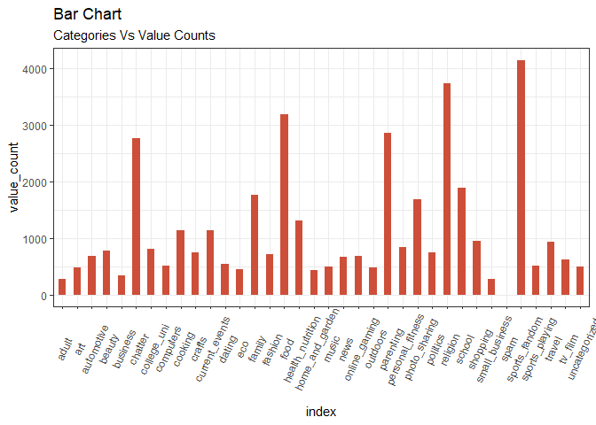
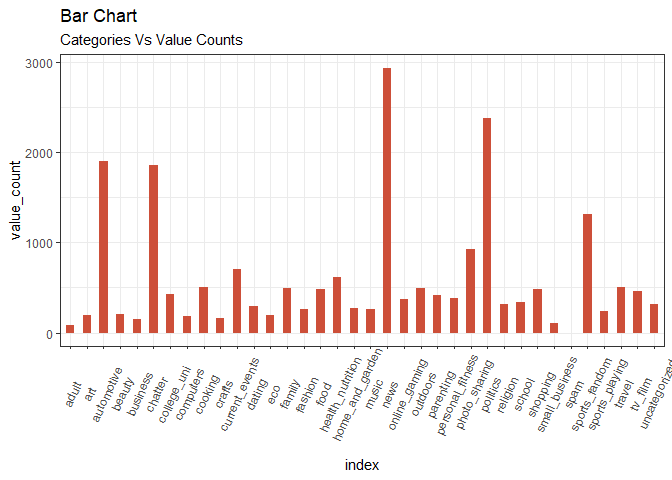
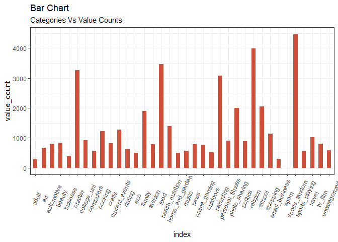
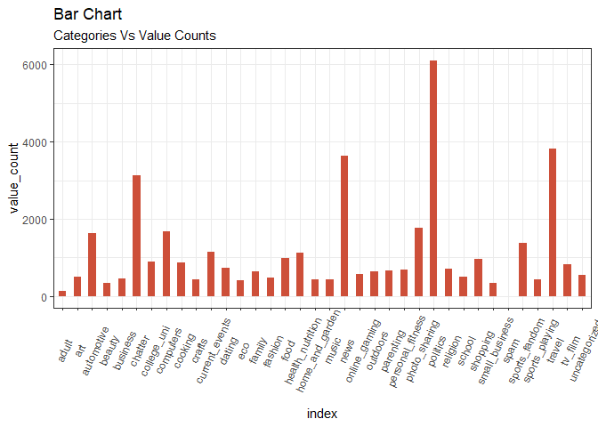
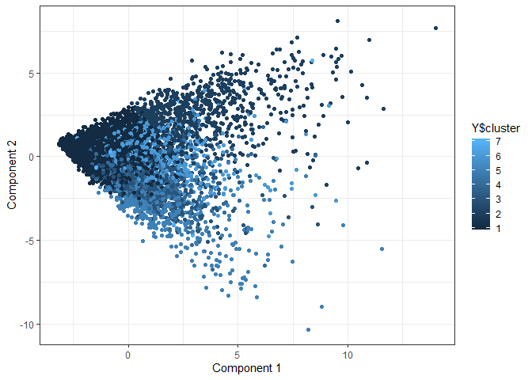

Market Segmentation
================

Akankshi Modi and Javeria Rangoonwala
8/11/2019


``` r
rm(list=ls())
library(ggplot2)
library(LICORS)  # for kmeans++
library(foreach)
library(mosaic)
```

    ## Loading required package: dplyr

    ## 
    ## Attaching package: 'dplyr'

    ## The following objects are masked from 'package:stats':
    ## 
    ##     filter, lag

    ## The following objects are masked from 'package:base':
    ## 
    ##     intersect, setdiff, setequal, union

    ## Loading required package: lattice

    ## Loading required package: ggformula

    ## Loading required package: ggstance

    ## 
    ## Attaching package: 'ggstance'

    ## The following objects are masked from 'package:ggplot2':
    ## 
    ##     geom_errorbarh, GeomErrorbarh

    ## 
    ## New to ggformula?  Try the tutorials: 
    ##  learnr::run_tutorial("introduction", package = "ggformula")
    ##  learnr::run_tutorial("refining", package = "ggformula")

    ## Loading required package: mosaicData

    ## Loading required package: Matrix

    ## Registered S3 method overwritten by 'mosaic':
    ##   method                           from   
    ##   fortify.SpatialPolygonsDataFrame ggplot2

    ## 
    ## The 'mosaic' package masks several functions from core packages in order to add 
    ## additional features.  The original behavior of these functions should not be affected by this.
    ## 
    ## Note: If you use the Matrix package, be sure to load it BEFORE loading mosaic.

    ## 
    ## Attaching package: 'mosaic'

    ## The following object is masked from 'package:Matrix':
    ## 
    ##     mean

    ## The following objects are masked from 'package:dplyr':
    ## 
    ##     count, do, tally

    ## The following object is masked from 'package:ggplot2':
    ## 
    ##     stat

    ## The following objects are masked from 'package:stats':
    ## 
    ##     binom.test, cor, cor.test, cov, fivenum, IQR, median,
    ##     prop.test, quantile, sd, t.test, var

    ## The following objects are masked from 'package:base':
    ## 
    ##     max, mean, min, prod, range, sample, sum

``` r
library(dplyr)

raw.data = read.csv('social_marketing.csv', header=TRUE)

summary(raw.data)
```

    ##          X           chatter       current_events      travel      
    ##  123pxkyqj:   1   Min.   : 0.000   Min.   :0.000   Min.   : 0.000  
    ##  12grikctu:   1   1st Qu.: 2.000   1st Qu.:1.000   1st Qu.: 0.000  
    ##  12klxic7j:   1   Median : 3.000   Median :1.000   Median : 1.000  
    ##  12t4msroj:   1   Mean   : 4.399   Mean   :1.526   Mean   : 1.585  
    ##  12yam59l3:   1   3rd Qu.: 6.000   3rd Qu.:2.000   3rd Qu.: 2.000  
    ##  132y8f6aj:   1   Max.   :26.000   Max.   :8.000   Max.   :26.000  
    ##  (Other)  :7876                                                    
    ##  photo_sharing    uncategorized      tv_film      sports_fandom   
    ##  Min.   : 0.000   Min.   :0.000   Min.   : 0.00   Min.   : 0.000  
    ##  1st Qu.: 1.000   1st Qu.:0.000   1st Qu.: 0.00   1st Qu.: 0.000  
    ##  Median : 2.000   Median :1.000   Median : 1.00   Median : 1.000  
    ##  Mean   : 2.697   Mean   :0.813   Mean   : 1.07   Mean   : 1.594  
    ##  3rd Qu.: 4.000   3rd Qu.:1.000   3rd Qu.: 1.00   3rd Qu.: 2.000  
    ##  Max.   :21.000   Max.   :9.000   Max.   :17.00   Max.   :20.000  
    ##                                                                   
    ##     politics           food            family        home_and_garden 
    ##  Min.   : 0.000   Min.   : 0.000   Min.   : 0.0000   Min.   :0.0000  
    ##  1st Qu.: 0.000   1st Qu.: 0.000   1st Qu.: 0.0000   1st Qu.:0.0000  
    ##  Median : 1.000   Median : 1.000   Median : 1.0000   Median :0.0000  
    ##  Mean   : 1.789   Mean   : 1.397   Mean   : 0.8639   Mean   :0.5207  
    ##  3rd Qu.: 2.000   3rd Qu.: 2.000   3rd Qu.: 1.0000   3rd Qu.:1.0000  
    ##  Max.   :37.000   Max.   :16.000   Max.   :10.0000   Max.   :5.0000  
    ##                                                                      
    ##      music              news        online_gaming       shopping     
    ##  Min.   : 0.0000   Min.   : 0.000   Min.   : 0.000   Min.   : 0.000  
    ##  1st Qu.: 0.0000   1st Qu.: 0.000   1st Qu.: 0.000   1st Qu.: 0.000  
    ##  Median : 0.0000   Median : 0.000   Median : 0.000   Median : 1.000  
    ##  Mean   : 0.6793   Mean   : 1.206   Mean   : 1.209   Mean   : 1.389  
    ##  3rd Qu.: 1.0000   3rd Qu.: 1.000   3rd Qu.: 1.000   3rd Qu.: 2.000  
    ##  Max.   :13.0000   Max.   :20.000   Max.   :27.000   Max.   :12.000  
    ##                                                                      
    ##  health_nutrition  college_uni     sports_playing      cooking      
    ##  Min.   : 0.000   Min.   : 0.000   Min.   :0.0000   Min.   : 0.000  
    ##  1st Qu.: 0.000   1st Qu.: 0.000   1st Qu.:0.0000   1st Qu.: 0.000  
    ##  Median : 1.000   Median : 1.000   Median :0.0000   Median : 1.000  
    ##  Mean   : 2.567   Mean   : 1.549   Mean   :0.6392   Mean   : 1.998  
    ##  3rd Qu.: 3.000   3rd Qu.: 2.000   3rd Qu.:1.0000   3rd Qu.: 2.000  
    ##  Max.   :41.000   Max.   :30.000   Max.   :8.0000   Max.   :33.000  
    ##                                                                     
    ##       eco           computers          business         outdoors      
    ##  Min.   :0.0000   Min.   : 0.0000   Min.   :0.0000   Min.   : 0.0000  
    ##  1st Qu.:0.0000   1st Qu.: 0.0000   1st Qu.:0.0000   1st Qu.: 0.0000  
    ##  Median :0.0000   Median : 0.0000   Median :0.0000   Median : 0.0000  
    ##  Mean   :0.5123   Mean   : 0.6491   Mean   :0.4232   Mean   : 0.7827  
    ##  3rd Qu.:1.0000   3rd Qu.: 1.0000   3rd Qu.:1.0000   3rd Qu.: 1.0000  
    ##  Max.   :6.0000   Max.   :16.0000   Max.   :6.0000   Max.   :12.0000  
    ##                                                                       
    ##      crafts         automotive           art             religion     
    ##  Min.   :0.0000   Min.   : 0.0000   Min.   : 0.0000   Min.   : 0.000  
    ##  1st Qu.:0.0000   1st Qu.: 0.0000   1st Qu.: 0.0000   1st Qu.: 0.000  
    ##  Median :0.0000   Median : 0.0000   Median : 0.0000   Median : 0.000  
    ##  Mean   :0.5159   Mean   : 0.8299   Mean   : 0.7248   Mean   : 1.095  
    ##  3rd Qu.:1.0000   3rd Qu.: 1.0000   3rd Qu.: 1.0000   3rd Qu.: 1.000  
    ##  Max.   :7.0000   Max.   :13.0000   Max.   :18.0000   Max.   :20.000  
    ##                                                                       
    ##      beauty          parenting           dating            school       
    ##  Min.   : 0.0000   Min.   : 0.0000   Min.   : 0.0000   Min.   : 0.0000  
    ##  1st Qu.: 0.0000   1st Qu.: 0.0000   1st Qu.: 0.0000   1st Qu.: 0.0000  
    ##  Median : 0.0000   Median : 0.0000   Median : 0.0000   Median : 0.0000  
    ##  Mean   : 0.7052   Mean   : 0.9213   Mean   : 0.7109   Mean   : 0.7677  
    ##  3rd Qu.: 1.0000   3rd Qu.: 1.0000   3rd Qu.: 1.0000   3rd Qu.: 1.0000  
    ##  Max.   :14.0000   Max.   :14.0000   Max.   :24.0000   Max.   :11.0000  
    ##                                                                         
    ##  personal_fitness    fashion        small_business        spam        
    ##  Min.   : 0.000   Min.   : 0.0000   Min.   :0.0000   Min.   :0.00000  
    ##  1st Qu.: 0.000   1st Qu.: 0.0000   1st Qu.:0.0000   1st Qu.:0.00000  
    ##  Median : 0.000   Median : 0.0000   Median :0.0000   Median :0.00000  
    ##  Mean   : 1.462   Mean   : 0.9966   Mean   :0.3363   Mean   :0.00647  
    ##  3rd Qu.: 2.000   3rd Qu.: 1.0000   3rd Qu.:1.0000   3rd Qu.:0.00000  
    ##  Max.   :19.000   Max.   :18.0000   Max.   :6.0000   Max.   :2.00000  
    ##                                                                       
    ##      adult        
    ##  Min.   : 0.0000  
    ##  1st Qu.: 0.0000  
    ##  Median : 0.0000  
    ##  Mean   : 0.4033  
    ##  3rd Qu.: 0.0000  
    ##  Max.   :26.0000  
    ## 

``` r
raw.data <- distinct(raw.data)
raw.data[is.na(raw.data)] <- 0
```

``` r
head(raw.data)
```

    ##           X chatter current_events travel photo_sharing uncategorized
    ## 1 hmjoe4g3k       2              0      2             2             2
    ## 2 clk1m5w8s       3              3      2             1             1
    ## 3 jcsovtak3       6              3      4             3             1
    ## 4 3oeb4hiln       1              5      2             2             0
    ## 5 fd75x1vgk       5              2      0             6             1
    ## 6 h6nvj91yp       6              4      2             7             0
    ##   tv_film sports_fandom politics food family home_and_garden music news
    ## 1       1             1        0    4      1               2     0    0
    ## 2       1             4        1    2      2               1     0    0
    ## 3       5             0        2    1      1               1     1    1
    ## 4       1             0        1    0      1               0     0    0
    ## 5       0             0        2    0      1               0     0    0
    ## 6       1             1        0    2      1               1     1    0
    ##   online_gaming shopping health_nutrition college_uni sports_playing
    ## 1             0        1               17           0              2
    ## 2             0        0                0           0              1
    ## 3             0        2                0           0              0
    ## 4             0        0                0           1              0
    ## 5             3        2                0           4              0
    ## 6             0        5                0           0              0
    ##   cooking eco computers business outdoors crafts automotive art religion
    ## 1       5   1         1        0        2      1          0   0        1
    ## 2       0   0         0        1        0      2          0   0        0
    ## 3       2   1         0        0        0      2          0   8        0
    ## 4       0   0         0        1        0      3          0   2        0
    ## 5       1   0         1        0        1      0          0   0        0
    ## 6       0   0         1        1        0      0          1   0        0
    ##   beauty parenting dating school personal_fitness fashion small_business
    ## 1      0         1      1      0               11       0              0
    ## 2      0         0      1      4                0       0              0
    ## 3      1         0      1      0                0       1              0
    ## 4      1         0      0      0                0       0              0
    ## 5      0         0      0      0                0       0              1
    ## 6      0         0      0      0                0       0              0
    ##   spam adult
    ## 1    0     0
    ## 2    0     0
    ## 3    0     0
    ## 4    0     0
    ## 5    0     0
    ## 6    0     0

``` r
# Center and scale the data
X = raw.data[,-2]
X = X[,-5]
X = X[,-1]
#X
X = scale(X, center=TRUE, scale=TRUE)

# Extract the centers and scales from the rescaled data (which are named attributes)
mu = attr(X,"scaled:center")
sigma = attr(X,"scaled:scale")
```

Elbow method to find a value of k. Since k = 10 seems like an elbow, we
are going to take k = 10 to create clusters.

``` r
k_grid = seq(2, 20, by=1)
SSE_grid = foreach(k = k_grid, .combine='c') %do% {
  cluster_k = kmeans(X, k, nstart=50)
  cluster_k$tot.withinss
}
```

    ## Warning: did not converge in 10 iterations
    
    ## Warning: did not converge in 10 iterations
    
    ## Warning: did not converge in 10 iterations
    
    ## Warning: did not converge in 10 iterations

``` r
plot(k_grid, SSE_grid)
```

<!-- -->

``` r
# Run k-means with 10 clusters and 25 starts
clust1 = kmeans(X, 10, nstart=25)

# What are the clusters?
clust1$center  # not super helpful
```

    ##    current_events      travel photo_sharing      tv_film sports_fandom
    ## 1     -0.01031450 -0.15714384   -0.08421245 -0.145999378    -0.2017286
    ## 2     -0.20281680 -0.21908597   -0.42320159 -0.222078934    -0.3229844
    ## 3      0.36511293 -0.20566843    1.14465223 -0.124894450    -0.2057396
    ## 4      0.07009668 -0.18841407   -0.20447614 -0.007645991     0.6677047
    ## 5      0.27684711  0.28872703   -0.09071828 -0.116191009     0.1406567
    ## 6      0.10842499  3.24061517   -0.11133845 -0.067917014    -0.2121407
    ## 7      0.18517132 -0.06130126    1.24815395 -0.150639666    -0.2087792
    ## 8     -0.08291475 -0.04385822   -0.02082668  0.097903233    -0.1261881
    ## 9      0.10988087 -0.09813918   -0.08116542 -0.095409247     2.0782988
    ## 10     0.30439005  0.22751673   -0.05831114  2.795550927    -0.1221757
    ##       politics        food      family home_and_garden         music
    ## 1  -0.19850173  0.44533501 -0.07921331      0.14309636  0.0007582097
    ## 2  -0.30075489 -0.36324183 -0.30444967     -0.20310521 -0.2341819374
    ## 3  -0.15331111 -0.30920044 -0.05048685      0.14284720  0.1581977664
    ## 4   1.21986287 -0.16546991  0.23209424      0.15020726 -0.0868021246
    ## 5   0.15052740  0.04049422 -0.05999555      0.23510191  0.0141826414
    ## 6   3.09299191  0.15319335 -0.10178647      0.04861894 -0.0424032763
    ## 7  -0.12821438 -0.20892445  0.03370569      0.14091353  0.5432022033
    ## 8  -0.17701573 -0.09437659  0.19602068      0.06781279 -0.0463005729
    ## 9  -0.22631717  1.84148800  1.51713078      0.16499274  0.0437575815
    ## 10 -0.08944974  0.14221566 -0.12482059      0.32825144  1.0176851981
    ##             news online_gaming     shopping health_nutrition college_uni
    ## 1  -0.0781263661   -0.11738951 -0.027278767       2.19145217 -0.21218216
    ## 2  -0.3100432259   -0.23328166 -0.397012981      -0.31347078 -0.25996975
    ## 3  -0.2773979296   -0.17257665  1.442102920      -0.28489533 -0.09732903
    ## 4   2.6430813586   -0.12914740 -0.154114346      -0.25427982 -0.19204785
    ## 5  -0.0006901999    0.08935906 -0.237822640       0.05086059  0.12732753
    ## 6   1.1311937054   -0.17020420 -0.063773747      -0.16888521 -0.04535510
    ## 7  -0.0725779728   -0.02302969  0.205576555      -0.05671458 -0.01848761
    ## 8  -0.1954120402    3.56081422 -0.137155930      -0.18099492  3.26295699
    ## 9  -0.1110972157   -0.07661410 -0.001255721      -0.14540284 -0.12639829
    ## 10  0.0080771940   -0.16979952  0.063925744      -0.15340741  0.36432997
    ##    sports_playing     cooking          eco   computers    business
    ## 1     -0.01212209  0.40290837  0.537420439 -0.08330833  0.06827417
    ## 2     -0.25562089 -0.33244674 -0.283326912 -0.25869537 -0.25645042
    ## 3     -0.08643514 -0.23558604  0.333578270 -0.02849527  0.40892526
    ## 4     -0.08834545 -0.24669524 -0.084837993 -0.19476736 -0.11210726
    ## 5     -0.11129036 -0.05898219  0.447999475  0.29753290 -0.34600901
    ## 6      0.03397021 -0.18726026  0.163839787  2.90575083  0.55149265
    ## 7      0.19833094  2.77857498  0.005222658  0.06221115  0.21697157
    ## 8      2.11055596 -0.12466299 -0.064571960 -0.08529154 -0.10718460
    ## 9      0.11285195 -0.09481309  0.195459551  0.09365098  0.11721326
    ## 10     0.11616623 -0.13723963  0.120424171 -0.14970821  0.34555811
    ##       outdoors      crafts  automotive          art   religion
    ## 1   1.69635263  0.07044317 -0.16476776 -0.072128442 -0.1684269
    ## 2  -0.32308801 -0.29539261 -0.30859458 -0.236459267 -0.3030137
    ## 3  -0.28857171  0.09507588  0.05646194 -0.217151726 -0.2604676
    ## 4   0.30161324 -0.16891614  2.60214809 -0.169066894 -0.1870036
    ## 5   0.29780310  0.21793373  0.12453564  0.331675372  0.1207018
    ## 6  -0.03518560  0.20191288 -0.13186537 -0.162228781  0.1139277
    ## 7   0.02445303  0.08551824  0.02444810  0.002304522 -0.1265627
    ## 8  -0.14553424  0.03314862  0.05356771  0.265761654 -0.1872570
    ## 9  -0.07004825  0.69680699  0.12238906 -0.014688654  2.2857040
    ## 10 -0.08902099  0.76714571 -0.22498650  2.717078011  0.0167601
    ##          beauty   parenting       dating      school personal_fitness
    ## 1  -0.206933153 -0.09216199  0.206573832 -0.15717957       2.12768764
    ## 2  -0.274471899 -0.32285252 -0.147878131 -0.31300180      -0.33077612
    ## 3  -0.202887064 -0.19978108  0.179225961  0.04248506      -0.23251034
    ## 4  -0.175314599  0.03062125 -0.012298445  0.01710054      -0.24096389
    ## 5  -0.100701954  0.18658414 -0.009528244  0.09244824       0.12183236
    ## 6  -0.177892858  0.01648978  0.342903897 -0.10166629      -0.14747810
    ## 7   2.619561091 -0.06525900  0.066042833  0.18519238      -0.03513757
    ## 8  -0.226461489 -0.14185987  0.011469008 -0.21013346      -0.18980414
    ## 9   0.325836301  2.16613593  0.045405677  1.69230235      -0.09456893
    ## 10  0.001768972 -0.18400910 -0.056588415 -0.02331020      -0.15364987
    ##        fashion small_business        spam        adult
    ## 1  -0.10449162    -0.11581904 -0.07768727  0.004532443
    ## 2  -0.29308682    -0.22036324 -0.07768727 -0.011226241
    ## 3  -0.08613703     0.25208745 -0.07768727 -0.020733000
    ## 4  -0.21613941    -0.16017031 -0.07768727 -0.109326046
    ## 5  -0.02044987     0.31428826 12.41886450  3.750222155
    ## 6  -0.17270913     0.39729226 -0.07768727 -0.144522474
    ## 7   2.67732938     0.15251440 -0.07768727 -0.022090055
    ## 8  -0.05418228     0.11912436 -0.07768727 -0.013136802
    ## 9   0.02913943     0.09397799 -0.07768727  0.003988664
    ## 10 -0.01590149     0.80670810 -0.07768727 -0.045948354

``` r
clust1$center[1,]*sigma + mu
```

    ##   current_events           travel    photo_sharing          tv_film 
    ##     1.513174e+00     1.225847e+00     2.466750e+00     8.281054e-01 
    ##    sports_fandom         politics             food           family 
    ##     1.158093e+00     1.186951e+00     2.188206e+00     7.741531e-01 
    ##  home_and_garden            music             news    online_gaming 
    ##     6.260979e-01     6.800502e-01     1.041405e+00     8.933501e-01 
    ##         shopping health_nutrition      college_uni   sports_playing 
    ##     1.340025e+00     1.242033e+01     9.347553e-01     6.273526e-01 
    ##          cooking              eco        computers         business 
    ##     3.380176e+00     9.259724e-01     5.508156e-01     4.705144e-01 
    ##         outdoors           crafts       automotive              art 
    ##     2.834379e+00     5.734003e-01     6.047679e-01     6.072773e-01 
    ##         religion           beauty        parenting           dating 
    ##     7.728984e-01     4.303639e-01     7.816813e-01     1.079046e+00 
    ##           school personal_fitness          fashion   small_business 
    ##     5.809285e-01     6.579674e+00     8.055207e-01     2.647428e-01 
    ##             spam            adult 
    ##    -4.423545e-17     4.115433e-01

``` r
clust1$center[2,]*sigma + mu
```

    ##   current_events           travel    photo_sharing          tv_film 
    ##     1.268910e+00     1.084276e+00     1.540798e+00     7.019059e-01 
    ##    sports_fandom         politics             food           family 
    ##     8.960691e-01     8.770101e-01     7.525313e-01     5.190590e-01 
    ##  home_and_garden            music             news    online_gaming 
    ##     3.710542e-01     4.380584e-01     5.541989e-01     5.818940e-01 
    ##         shopping health_nutrition      college_uni   sports_playing 
    ##     6.712329e-01     1.157832e+00     7.963073e-01     3.898154e-01 
    ##          cooking              eco        computers         business 
    ##     8.579512e-01     2.942228e-01     3.439547e-01     2.456820e-01 
    ##         outdoors           crafts       automotive              art 
    ##     3.918999e-01     2.745682e-01     4.082787e-01     3.394878e-01 
    ##         religion           beauty        parenting           dating 
    ##     5.151876e-01     3.406790e-01     4.321024e-01     4.472901e-01 
    ##           school personal_fitness          fashion   small_business 
    ##     3.957713e-01     6.664681e-01     4.606909e-01     2.001191e-01 
    ##             spam            adult 
    ##    -2.888315e-16     3.829661e-01

``` r
clust1$center[4,]*sigma + mu
```

    ##   current_events           travel    photo_sharing          tv_film 
    ##     1.615207e+00     1.154378e+00     2.138249e+00     1.057604e+00 
    ##    sports_fandom         politics             food           family 
    ##     3.036866e+00     5.486175e+00     1.103687e+00     1.126728e+00 
    ##  home_and_garden            music             news    online_gaming 
    ##     6.313364e-01     5.898618e-01     6.758065e+00     8.617512e-01 
    ##         shopping health_nutrition      college_uni   sports_playing 
    ##     1.110599e+00     1.423963e+00     9.930876e-01     5.529954e-01 
    ##          cooking              eco        computers         business 
    ##     1.152074e+00     4.470046e-01     4.193548e-01     3.456221e-01 
    ##         outdoors           crafts       automotive              art 
    ##     1.147465e+00     3.778802e-01     4.384793e+00     4.493088e-01 
    ##         religion           beauty        parenting           dating 
    ##     7.373272e-01     4.723502e-01     9.677419e-01     6.889401e-01 
    ##           school personal_fitness          fashion   small_business 
    ##     7.880184e-01     8.824885e-01     6.013825e-01     2.373272e-01 
    ##             spam            adult 
    ##     5.117434e-17     2.050691e-01

To find which products are in which cluster, we run the following code

``` r
library(ggplot2)
theme_set(theme_bw())
Y = data.frame(raw.data)
Y$cluster = 0
for (i in 1:10){
  for (j in which(clust1$cluster == i)){
    Y[j,"cluster"] = i
  }
  
}
```

We constructed this ordered bar chart to see which categories are most
closest to which clusters. In some clusters, only 1 or 2 categories are
common, such as, in Cluster 6 where college uni and online gaming are
the only prevalent categories. However, in other clusters, there is a
good mix of equally important categories, such as, that in Cluster 1,
where categories like sports fanthom, religion, parenting and food are
common.

``` r
par(mfrow=c(5,2))
for (i in 1:10) {
  
  mask = Y$cluster==i
  temp = Y[,-length(Y)]
  value_count = rowSums(t(temp[mask,-1]))
  df = as.data.frame(value_count)
  df$index = rownames(df)
  #print(df)


# Draw plot
  print(ggplot(df ,aes(x=index, y=value_count)) + 
          geom_bar(stat="identity", width=.5, fill="tomato3") +
          labs(title="Ordered Bar Chart",
               subtitle="Make Vs Avg. Mileage", 
               caption="source: mpg") + 
          theme(axis.text.x = element_text(angle=65, vjust=0.6)))
}
```

<!-- --><!-- --><!-- --><!-- --><!-- --><!-- --><!-- --><!-- --><!-- --><!-- -->

We also considered the CH index to look at possible estimates of K.
Since a good value for K in CH index is when the CH grid value is high,
we can conclude here that according to this method, k = 2 or k = 3 is a
reasonale k-value.

``` r
N = nrow(X)
CH_grid = foreach(k = k_grid, .combine='c') %do% {
  cluster_k = kmeans(X, k, nstart=50)
  W = cluster_k$tot.withinss
  B = cluster_k$betweenss
  CH = (B/W)*((N-k)/(k-1))
  CH
}
```

    ## Warning: did not converge in 10 iterations
    
    ## Warning: did not converge in 10 iterations
    
    ## Warning: did not converge in 10 iterations
    
    ## Warning: did not converge in 10 iterations

``` r
plot(k_grid, CH_grid)
```

<!-- -->

Using kmeans++, a random centroid value is chosen, and subsequent
cliusters are chosen on the basis of maximum distance between the
clusters. Here we can see a similar pattern as that in the ordered bar
chart above. Categories like online gaming and college uni are the only
ones important in one cluster, but categories like sports fandom and
religion have a number of other equally importamt categories in those
clusters.

``` r
# Using kmeans++ initialization
clust2 = kmeanspp(X, k=7, nstart=25)

Y = data.frame(raw.data)
Y$cluster = 0
for (i in 1:7){
  for (j in which(clust2$cluster == i)){
    Y[j,"cluster"] = i
  }
  
}
```

``` r
par(mfrow=c(5,2))
for (i in 1:7) {
  
  mask = Y$cluster==i
  temp = Y[,-length(Y)]
  value_count = rowSums(t(temp[mask,-1]))
  df = as.data.frame(value_count)
  df$index = rownames(df)
  #print(df)


# Draw plot
  print(ggplot(df ,aes(x=index, y=value_count)) + 
          geom_bar(stat="identity", width=.5, fill="tomato3") +
          labs(title="Ordered Bar Chart",
               subtitle="Make Vs Avg. Mileage", 
               caption="source: mpg") + 
          theme(axis.text.x = element_text(angle=65, vjust=0.6)))
}
```

<!-- --><!-- --><!-- --><!-- --><!-- --><!-- --><!-- -->

We conduct hierarchical clustering to see if we can determine the
optimum number of clusters based on the proximity matrix. However,
hierarchical clustering does not work well her for a range of k-values

``` r
# Form a pairwise distance matrix using the dist function
distance_matrix = dist(X, method='euclidean')


# Now run hierarchical clustering
hier_X = hclust(distance_matrix, method='average')


# Plot the dendrogram
plot(hier_X, cex=0.8)
```

<!-- -->

``` r
# Cut the tree into 5 clusters
clust3 = cutree(hier_X, k=37)
summary(factor(clust3))
```

    ##    1    2    3    4    5    6    7    8    9   10   11   12   13   14   15 
    ## 7656    4   11    3   69   46    2   16    4    8    2    2    1    6    1 
    ##   16   17   18   19   20   21   22   23   24   25   26   27   28   29   30 
    ##    2    2    5    7    4    2    5    2    2    1    1    2    4    1    3 
    ##   31   32   33   34   35   36   37 
    ##    2    1    1    1    1    1    1

The average distance of the withinss of cluster 1 is around 18% of the
average distance of betweens of cluster 1. Hence, based on this data,
our clusters seem to be separated in an clear way.

``` r
# Compare versus within-cluster average distances for first two clusters
clust1$withinss
```

    ##  [1] 20358.004 40093.832 21522.156 10561.062  2332.419 11609.237 15995.409
    ##  [8] 10248.214 24125.889 15056.725

``` r
clust2$withinss
```

    ## [1] 27075.633 24169.153 74147.403 15699.808 27698.931 19903.166  2332.419

``` r
sum(clust1$withinss)
```

    ## [1] 171902.9

``` r
sum(clust2$withinss)
```

    ## [1] 191026.5

``` r
clust1$betweenss
```

    ## [1] 96051.05

``` r
clust2$betweenss
```

    ## [1] 76927.49

``` r
mean(clust1$withinss)
```

    ## [1] 17190.29

``` r
mean(clust2$withinss)
```

    ## [1] 27289.5

``` r
mean(clust1$betweenss)
```

    ## [1] 96051.05

``` r
mean(clust2$betweenss)
```

    ## [1] 76927.49

PCR We also tried PCR to look at the different kinds of users in our
market. We will look at the top 15 variables. In PC space, most of the
original observations end up near/close to zero. In the second graph, we
can see that categories such as sports fanthom, parenting and religion
are the most common one. Only one graph is shown here for context.

``` r
pc2 = prcomp(X, scale=TRUE, rank=2)
loadings = pc2$rotation
scores = pc2$x
```

``` r
qplot(scores[,1], scores[,2], color=Y$cluster, xlab='Component 1', ylab='Component 2')
```

<!-- -->

``` r
barplot(loadings[,1], las = 2)
```

<!-- -->

The information in this data can be used to bring meaningful insights.
For example, if Nutrient H20 is planning to extend its product line or
diversify in new products, it can look for categories that are
consistent with its target market. For example, if Nutrient H20 plans to
target parents, I believe it can incorporate some aspect of food and
religion in its value chain so that its more reachable to parents.

Now we will look at correlation between categories which are not
distinct such as uncategorized and chatter with distinct
    categories.

``` r
cor.chatter <- cor(raw.data$chatter, raw.data[,-1])
```

``` r
cor(raw.data[,-1]$spam, raw.data[,-1])
```

    ##          chatter current_events     travel photo_sharing uncategorized
    ## [1,] 0.004603242     0.01940299 0.02277335  -0.008664858    0.01389805
    ##           tv_film sports_fandom    politics        food       family
    ## [1,] -0.004210646   0.008957464 0.009438922 0.001482766 -0.006802752
    ##      home_and_garden        music         news online_gaming    shopping
    ## [1,]      0.02160085 0.0005284301 -0.001800012   0.005867025 -0.01925162
    ##      health_nutrition college_uni sports_playing      cooking        eco
    ## [1,]      0.002395824 0.009452985   -0.008742556 -0.006178129 0.03141528
    ##       computers    business   outdoors     crafts  automotive        art
    ## [1,] 0.02311745 -0.02549185 0.02151895 0.01993976 0.008560904 0.02433927
    ##         religion       beauty  parenting      dating      school
    ## [1,] 0.008062977 -0.009135427 0.01609741 -0.00192651 0.006214842
    ##      personal_fitness      fashion small_business spam    adult
    ## [1,]       0.00787607 -0.003187322     0.03166214    1 0.294399

``` r
cor(raw.data[,-1]$uncategorized, raw.data[,-1])
```

    ##         chatter current_events     travel photo_sharing uncategorized
    ## [1,] 0.06699344     0.02967423 0.03086556     0.0963981             1
    ##       tv_film sports_fandom     politics       food       family
    ## [1,] 0.163279 -0.0005287314 -0.001143143 0.03534767 -0.004628184
    ##      home_and_garden     music        news online_gaming   shopping
    ## [1,]      0.07425914 0.1439077 0.003740334    0.02360168 0.05531255
    ##      health_nutrition college_uni sports_playing  cooking        eco
    ## [1,]       0.07985597  0.09471863     0.08383012 0.161257 0.04723203
    ##       computers   business   outdoors     crafts automotive       art
    ## [1,] 0.02663922 0.06596542 0.09390228 0.08919657 0.01391642 0.1064475
    ##        religion    beauty   parenting    dating     school
    ## [1,] 0.01703849 0.1373705 0.006268064 0.1270238 0.05825994
    ##      personal_fitness   fashion small_business       spam      adult
    ## [1,]       0.08472959 0.1414087     0.08483203 0.01389805 0.04519669

``` r
correlation <- round(cor(raw.data[,-1]),2)
```

``` r
library(reshape2)
melted_cormat <- melt(correlation, na.rm = TRUE)
# Heatmap
library(ggplot2)
ggplot(data = melted_cormat, aes(Var2, Var1, fill = value))+
 geom_tile(color = "white")+
 scale_fill_gradient2(low = "blue", high = "red", mid = "white", 
   midpoint = 0, limit = c(-1,1), space = "Lab", 
   name="Pearson\nCorrelation") +
  theme_minimal()+ 
 theme(axis.text.x = element_text(angle = 45, vjust = 1, 
    size = 5, hjust = 1))+
 coord_fixed()
```

<!-- -->

Photo-sharing and shopping are most related to chatter. As expected with
spam, the adult category is the most correlated. With uncategorized,
dating, cooking, tv-film and beauty are most correlated.

In the general correlation heatmap, the highest correlated categories 
which have a correlation approximately equal to 1 are 
(health_nutrition, personal_fitness) and (college_uni, online gaming).
Since our company is a large consumer brand company, correlation between 
categories such as photo-sharing and shopping can be extremely useful
to them. For example, closely related tweets in categories such as 
photo sharing and shopping leads me to believe that such customers would 
ideally follow bloggers who post pictures of everything on social media.
The company can use bloggers as one of their marketing techniques.
