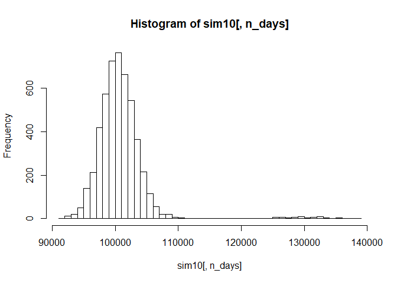
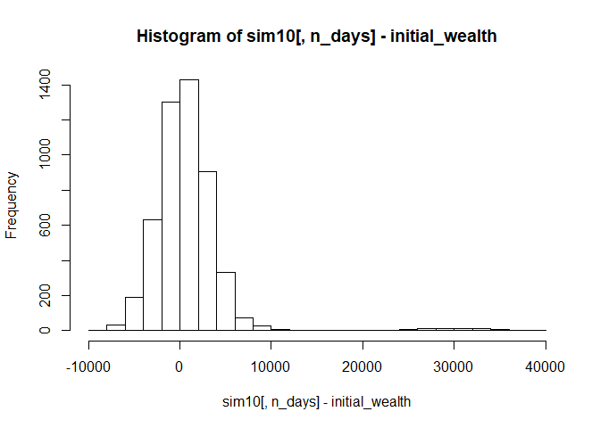
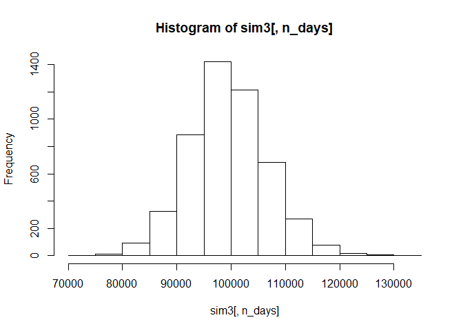
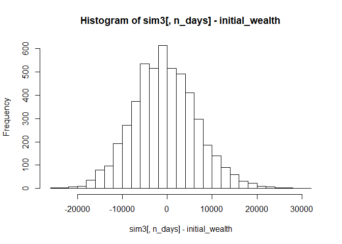
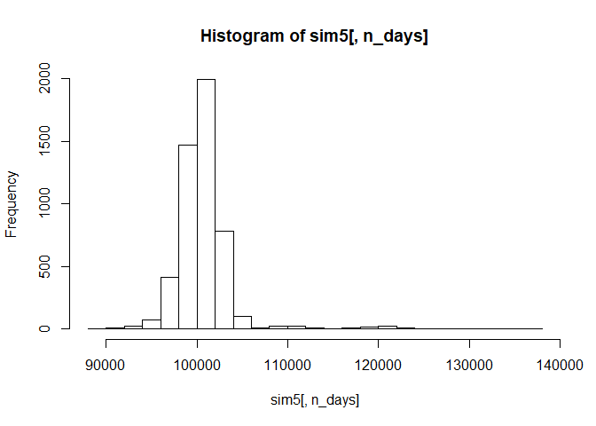
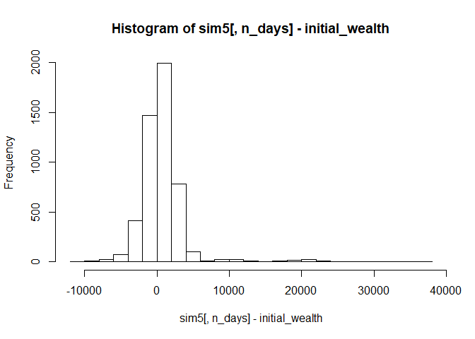

PortfolioRExam
================
Shelby Watson
8/11/2019

``` r
library(mosaic)
```

    ## Loading required package: dplyr

    ## 
    ## Attaching package: 'dplyr'

    ## The following objects are masked from 'package:stats':
    ## 
    ##     filter, lag

    ## The following objects are masked from 'package:base':
    ## 
    ##     intersect, setdiff, setequal, union

    ## Loading required package: lattice

    ## Loading required package: ggformula

    ## Loading required package: ggplot2

    ## Loading required package: ggstance

    ## 
    ## Attaching package: 'ggstance'

    ## The following objects are masked from 'package:ggplot2':
    ## 
    ##     geom_errorbarh, GeomErrorbarh

    ## 
    ## New to ggformula?  Try the tutorials: 
    ##  learnr::run_tutorial("introduction", package = "ggformula")
    ##  learnr::run_tutorial("refining", package = "ggformula")

    ## Loading required package: mosaicData

    ## Loading required package: Matrix

    ## Registered S3 method overwritten by 'mosaic':
    ##   method                           from   
    ##   fortify.SpatialPolygonsDataFrame ggplot2

    ## 
    ## The 'mosaic' package masks several functions from core packages in order to add 
    ## additional features.  The original behavior of these functions should not be affected by this.
    ## 
    ## Note: If you use the Matrix package, be sure to load it BEFORE loading mosaic.

    ## 
    ## Attaching package: 'mosaic'

    ## The following object is masked from 'package:Matrix':
    ## 
    ##     mean

    ## The following object is masked from 'package:ggplot2':
    ## 
    ##     stat

    ## The following objects are masked from 'package:dplyr':
    ## 
    ##     count, do, tally

    ## The following objects are masked from 'package:stats':
    ## 
    ##     binom.test, cor, cor.test, cov, fivenum, IQR, median,
    ##     prop.test, quantile, sd, t.test, var

    ## The following objects are masked from 'package:base':
    ## 
    ##     max, mean, min, prod, range, sample, sum

``` r
library(quantmod)
```

    ## Loading required package: xts

    ## Loading required package: zoo

    ## 
    ## Attaching package: 'zoo'

    ## The following objects are masked from 'package:base':
    ## 
    ##     as.Date, as.Date.numeric

    ## Registered S3 method overwritten by 'xts':
    ##   method     from
    ##   as.zoo.xts zoo

    ## 
    ## Attaching package: 'xts'

    ## The following objects are masked from 'package:dplyr':
    ## 
    ##     first, last

    ## Loading required package: TTR

    ## Registered S3 method overwritten by 'quantmod':
    ##   method            from
    ##   as.zoo.data.frame zoo

    ## Version 0.4-0 included new data defaults. See ?getSymbols.

``` r
library(foreach)

# Import a few stocks
port1 = c("IWR", "VNQ", "SPY", "USO", "INR", "GOVT", "HEDJ", "QAI", "VEA", "VPU")
myprices = getSymbols(port1, from = "2014-01-02")
```

    ## 'getSymbols' currently uses auto.assign=TRUE by default, but will
    ## use auto.assign=FALSE in 0.5-0. You will still be able to use
    ## 'loadSymbols' to automatically load data. getOption("getSymbols.env")
    ## and getOption("getSymbols.auto.assign") will still be checked for
    ## alternate defaults.
    ## 
    ## This message is shown once per session and may be disabled by setting 
    ## options("getSymbols.warning4.0"=FALSE). See ?getSymbols for details.

    ## pausing 1 second between requests for more than 5 symbols
    ## pausing 1 second between requests for more than 5 symbols
    ## pausing 1 second between requests for more than 5 symbols
    ## pausing 1 second between requests for more than 5 symbols
    ## pausing 1 second between requests for more than 5 symbols
    ## pausing 1 second between requests for more than 5 symbols

``` r
# Adjust for splits and dividends
IWRa = adjustOHLC(IWR)
VNQa = adjustOHLC(VNQ)
SPYa = adjustOHLC(SPY)
USOa = adjustOHLC(USO)
INRa = adjustOHLC(INR)
GOVTa = adjustOHLC(GOVT)
HEDJa = adjustOHLC(HEDJ)
QAIa = adjustOHLC(QAI)
VEAa = adjustOHLC(VEA)
VPUa = adjustOHLC(VPU)
```

For my first portfolio, I decided to pick 10 random stocks from the
database of ETFs, thus giving me a diverse portfolio with many elements.
I made sure for every stock I picked that there were at least 5 years of
data.

``` r
all_returns10 = cbind(ClCl(IWRa),
                                ClCl(VNQa),
                                ClCl(SPYa),
                                ClCl(USOa),
                                ClCl(INRa),
                                ClCl(GOVTa),
                                ClCl(HEDJa),
                                ClCl(QAIa),
                                ClCl(VEAa),
                                ClCl(VPUa))
head(all_returns10)
```

    ##               ClCl.IWRa    ClCl.VNQa     ClCl.SPYa     ClCl.USOa
    ## 2014-01-02           NA           NA            NA            NA
    ## 2014-01-03  0.002154538  0.005575345 -0.0001640007 -0.0140227870
    ## 2014-01-06 -0.004703010  0.005082427 -0.0028979059 -0.0053333333
    ## 2014-01-07  0.007830458  0.004443779  0.0061416703  0.0002979446
    ## 2014-01-08  0.002478205 -0.004881769  0.0002180510 -0.0125075037
    ## 2014-01-09  0.001403114  0.000000000  0.0006538524 -0.0024124849
    ##               ClCl.INRa    ClCl.GOVTa    ClCl.HEDJa     ClCl.QAIa
    ## 2014-01-02           NA            NA            NA            NA
    ## 2014-01-03 0.0000000000 -0.0008229630  0.0018142598  0.0000000000
    ## 2014-01-06 0.0003164873  0.0020592668 -0.0005433176  0.0000000000
    ## 2014-01-07 0.0000000000 -0.0008220715  0.0097843995  0.0020797227
    ## 2014-01-08 0.0000000000 -0.0012339778 -0.0014354567 -0.0003459011
    ## 2014-01-09 0.0000000000  0.0012355024 -0.0010782030  0.0006920415
    ##                ClCl.VEAa     ClCl.VPUa
    ## 2014-01-02            NA            NA
    ## 2014-01-03  0.0002440703 -0.0020729910
    ## 2014-01-06 -0.0019517442  0.0002444404
    ## 2014-01-07  0.0058665852  0.0091619838
    ## 2014-01-08 -0.0002430863 -0.0052051930
    ## 2014-01-09 -0.0012153379  0.0047456802

``` r
all_returns10 = as.matrix(na.omit(all_returns10))
#get returns and eliminate any missing elements
```

``` r
initial_wealth = 100000
sim10 = foreach(i=1:5000, .combine='rbind') %do% {
    total_wealth = initial_wealth
    weights = c(0.1, 0.1, 0.1, 0.1, 0.1, 0.1, 0.1, 0.1, 0.1, 0.1)#equal redistribution everyday
    holdings = weights * total_wealth
    n_days = 20 #4 week trading period, so 20 days
    wealthtracker = rep(0, n_days)
    for(today in 1:n_days) {
        return.today = resample(all_returns10, 1, orig.ids=FALSE)
        holdings = holdings + holdings*return.today
        total_wealth = sum(holdings)
        #equal redistribution
        wealthtracker[today] = total_wealth
    }
    wealthtracker
}

head(sim10)
```

    ##               [,1]     [,2]     [,3]     [,4]     [,5]     [,6]     [,7]
    ## result.1 100469.18 100376.6 106711.0 106271.9 106031.9 106797.1 106571.7
    ## result.2  99977.33 100077.0 100323.7 100755.2 101065.1 100899.5 101294.2
    ## result.3 100208.19 100680.5 100850.1 100753.0 100655.6 100537.9 100614.0
    ## result.4  99984.56 101006.4 101973.6 102070.0 102299.3 102552.5 101929.9
    ## result.5 101310.29 101473.8 103176.1 103501.9 103614.2 102996.0 103329.6
    ## result.6 100623.19 101005.3 101302.7 101969.3 101655.6 101871.1 102176.7
    ##              [,8]     [,9]    [,10]    [,11]     [,12]     [,13]     [,14]
    ## result.1 103516.3 104093.7 104142.2 104168.5 104114.14 104452.73 102568.96
    ## result.2 100761.8 100709.5 101033.6 100749.7 101079.00  98426.55  98170.71
    ## result.3 100916.4 101283.8 100955.2 100872.6  99433.85  99182.98  99531.07
    ## result.4 101139.2 101464.5 101327.9 100860.1 101111.48 100733.14 101577.47
    ## result.5 104797.3 105045.4 105966.5 106020.7 106080.50 106728.73 107418.64
    ## result.6 102523.6 102209.6 101328.5 101599.7 101905.53 102123.67 102903.80
    ##              [,15]     [,16]     [,17]     [,18]     [,19]     [,20]
    ## result.1 102703.31 101961.40 102041.97 101520.97 102132.68 102271.23
    ## result.2  98175.86  98087.33  98297.81  98218.06  98461.91  97929.56
    ## result.3  99604.48  99144.58  99655.28 100301.89 101027.85 100906.92
    ## result.4 101702.77 101392.78 101469.44 100927.95 101911.77 102038.05
    ## result.5 107806.73 107484.53 107552.11 107284.64 107258.42 106962.53
    ## result.6 103282.09 103809.24 101059.91 101258.83 101803.32 102367.75

``` r
hist(sim10[,n_days], 50)
```

<!-- -->

``` r
mean(sim10[,n_days])
```

    ## [1] 100862.7

``` r
hist(sim10[,n_days]- initial_wealth, breaks=30)
```

<!-- -->

``` r
VAR10 = quantile(sim10[,n_days], .05)#calc VAR 5%
VAR10
```

    ##       5% 
    ## 96192.57

``` r
###3 stock

mystocks3 = c("XLE", "VDE", "XOP")
myprices = getSymbols(mystocks3, from = "2014-01-01")

# Adjust for splits and dividends
XLEa = adjustOHLC(XLE)
VDEa = adjustOHLC(VDE)
XOPa = adjustOHLC(XOP)
```

For my second portfolio, I chose to do Oil & Gas Energy EFTs, and only
do three of them. I wanted to create a riskier portfolio, so having only
three EFTs and basing all of them out of a pretty volatile industry
seemed to acheive this goal.

``` r
all_returns3 = cbind(ClCl(XLEa),
                                ClCl(VDEa),
                                ClCl(XOPa))
head(all_returns3)
```

    ##               ClCl.XLEa     ClCl.VDEa    ClCl.XOPa
    ## 2014-01-02           NA            NA           NA
    ## 2014-01-03 -0.003667622 -0.0024073423 -0.009089569
    ## 2014-01-06  0.001380456 -0.0002413047 -0.005413549
    ## 2014-01-07  0.007581803  0.0078043366  0.009222876
    ## 2014-01-08 -0.006954749 -0.0064665894 -0.004494427
    ## 2014-01-09 -0.003099839 -0.0034552030 -0.004063160

``` r
all_returns3 = as.matrix(na.omit(all_returns3))
#get returns and eliminate any missing elements
```

``` r
initial_wealth = 100000
sim3 = foreach(i=1:5000, .combine='rbind') %do% {
    total_wealth = initial_wealth
    weights = c(0.33, 0.33, 0.34) #as equally distributed as it can be each day
    holdings = weights * total_wealth
    n_days = 20 #4 week trading period
    wealthtracker = rep(0, n_days)
    for(today in 1:n_days) {
        return.today = resample(all_returns3, 1, orig.ids=FALSE)
        holdings = holdings + holdings*return.today
        total_wealth = sum(holdings)
        holdings = weights * total_wealth #equal redistribution
        wealthtracker[today] = total_wealth
    }
    wealthtracker
}

head(sim3)
```

    ##               [,1]      [,2]      [,3]      [,4]      [,5]      [,6]
    ## result.1  99659.17  99644.31 100225.83 101819.41 101641.25 101846.09
    ## result.2  98477.12  99869.65  98043.86  99293.36 101343.21  98392.70
    ## result.3 100503.39  98133.15  96731.89  96997.32  98774.14  98506.85
    ## result.4 100186.62  98530.20  98180.99  98104.13  95576.26  92115.76
    ## result.5 100762.15 101185.65 100670.09 101639.78 102192.74 103642.81
    ## result.6 102759.46 102663.83 102126.18 104425.95 105457.36 102558.26
    ##               [,7]      [,8]      [,9]     [,10]     [,11]     [,12]
    ## result.1 101005.05  97860.05  97973.83  97222.49  98568.68  97219.36
    ## result.2  96895.94  98728.67  98348.01  98348.85  98823.13  99464.30
    ## result.3  98569.22  97592.93  98588.99  98234.06  98157.16  99723.31
    ## result.4  90016.90  91223.79  92064.35  90919.96  91606.89  90920.92
    ## result.5 102112.88 100707.65  99790.56  95966.91  97782.08  98556.83
    ## result.6 103101.00 103337.89 103938.41 104465.78 105137.00 105233.05
    ##              [,13]     [,14]     [,15]     [,16]     [,17]     [,18]
    ## result.1  98207.80  96460.51  95458.95  93792.42  94932.54  93876.45
    ## result.2 100789.10 101710.27 102558.46 102297.61 104241.67 101493.84
    ## result.3  99738.63  99565.05 100135.88 100805.76 100460.90 101238.06
    ## result.4  90147.26  93115.30  94850.05  93031.48  89990.00  88308.37
    ## result.5  98094.51  97039.52  98026.14  97447.31  99543.69 102301.90
    ## result.6 104494.72 102378.88 103294.19 102843.78 103226.07 103463.25
    ##              [,19]     [,20]
    ## result.1  95531.61  92565.78
    ## result.2  99744.38  98811.25
    ## result.3 100440.56  99386.22
    ## result.4  87652.10  85823.07
    ## result.5 101780.85 102013.22
    ## result.6 104808.37 103640.39

``` r
hist(sim3[,n_days], 20)
```

<!-- -->

``` r
mean(sim3[,n_days])
```

    ## [1] 99458.79

``` r
hist(sim3[,n_days]- initial_wealth, breaks=30)
```

<!-- -->

``` r
VAR3 = quantile(sim3[,n_days], .05)#calc 5% VAR
VAR3
```

    ##       5% 
    ## 88176.91

``` r
###5 stocks - all Alternative EFTs (hedge fund and long short)

mystocks5 = c('MNA', 'RLY', 'HSPX','BTAL', 'CSM')
myprices = getSymbols(mystocks5, from = "2014-01-01")

# Adjust for splits and dividends
MNAa = adjustOHLC(MNA)
RLYa = adjustOHLC(RLY)
HSPXa = adjustOHLC(HSPX)
BTALa = adjustOHLC(BTAL)
CSMa = adjustOHLC(CSM)
```

For my last portfolio, I chose to do five alternative ETFs (hedge fund
and long-short). Since these are a different kind of ETF, I initially
figured they could be a riskier investment.

``` r
all_returns5 = cbind(ClCl(MNAa),
                                ClCl(RLYa),
                                ClCl(HSPXa),
                                ClCl(BTALa),
                                ClCl(CSMa))
head(all_returns5)
```

    ##                ClCl.MNAa     ClCl.RLYa    ClCl.HSPXa   ClCl.BTALa
    ## 2014-01-02            NA            NA            NA           NA
    ## 2014-01-03  0.0049224158 -0.0006947204  0.0045714514  0.002616379
    ## 2014-01-06  0.0007535041 -0.0006951686 -0.0002275768  0.000000000
    ## 2014-01-07  0.0041416041  0.0013913391  0.0040964953  0.000000000
    ## 2014-01-08 -0.0067491564 -0.0027788120 -0.0022665232 -0.004697286
    ## 2014-01-09 -0.0011325406 -0.0055729713  0.0002271468 -0.008390142
    ##                ClCl.CSMa
    ## 2014-01-02            NA
    ## 2014-01-03  0.0016025641
    ## 2014-01-06 -0.0030856686
    ## 2014-01-07  0.0030952194
    ## 2014-01-08  0.0002285257
    ## 2014-01-09  0.0015997259

``` r
all_returns5 = as.matrix(na.omit(all_returns5))
#get returns and eliminate any missing elements
```

``` r
initial_wealth = 100000
sim5 = foreach(i=1:5000, .combine='rbind') %do% {
    total_wealth = initial_wealth
    weights = c(0.2, 0.2, 0.2, 0.2, 0.2)#equal redistribution everyday
    holdings = weights * total_wealth
    n_days = 20 #4 week trading period, so 20 days
    wealthtracker = rep(0, n_days)
    for(today in 1:n_days) {
        return.today = resample(all_returns5, 1, orig.ids=FALSE)
        holdings = holdings + holdings*return.today
        total_wealth = sum(holdings)
        holdings = weights * total_wealth#equal redistribution
        wealthtracker[today] = total_wealth
    }
    wealthtracker
}

head(sim5)
```

    ##              [,1]      [,2]     [,3]      [,4]      [,5]      [,6]
    ## result.1 100200.3 100355.00 100393.8 100411.56  99623.56  99978.76
    ## result.2 100145.1 100444.77 100993.7 101161.14 101241.05 101506.12
    ## result.3 100293.0 100335.05 100217.4 100377.72 100904.23 101388.92
    ## result.4 100725.4 101118.41 100678.7  99561.32  99563.07  99474.98
    ## result.5 100243.5  99869.91 100299.1 100625.61  98980.32  98776.34
    ## result.6 100033.1 100598.78 100669.1 100250.12 101153.20 100996.94
    ##               [,7]      [,8]      [,9]     [,10]     [,11]     [,12]
    ## result.1 100091.89 100141.71 100144.98  99577.51 100093.74  99578.54
    ## result.2 101751.21 101894.80 101438.44 100908.02 101271.26 101377.79
    ## result.3 101494.46 102627.66 102648.43 102559.23 102452.46 101904.10
    ## result.4  98429.93  97246.90  97120.97  96630.70  97877.55  97944.84
    ## result.5  98929.58  97937.48  98189.79  98341.38  98169.05  98447.79
    ## result.6 100987.46 101077.07  99405.35  99680.34 100014.00  99532.52
    ##              [,13]     [,14]     [,15]     [,16]     [,17]     [,18]
    ## result.1  99657.19  99805.34  99856.97  99737.67  99662.52 100138.58
    ## result.2 101427.84 101210.47 101230.76 100804.48 101090.70 100302.20
    ## result.3 101434.62 101580.85 101248.30 101439.40 102231.05 102510.62
    ## result.4  97836.25  98554.27  98206.35  97681.54  97518.71  97157.40
    ## result.5  98673.30  98398.32  98181.92  98387.95  98410.23  98404.13
    ## result.6  99267.81  99922.09 100060.18  99734.30 100070.91 100348.80
    ##              [,19]     [,20]
    ## result.1 100259.82 100315.00
    ## result.2  99510.94  99934.87
    ## result.3 101729.69 101622.49
    ## result.4  97832.39  97634.79
    ## result.5  98614.47  98584.90
    ## result.6 101039.49 101032.59

``` r
hist(sim5[,n_days], 30)
```

<!-- -->

``` r
mean(sim5[,n_days])
```

    ## [1] 100681.7

``` r
hist(sim5[,n_days]- initial_wealth, breaks=30)
```

<!-- -->

``` r
VAR5 = quantile(sim5[,n_days], .05)#calculate 5% VAR
VAR5
```

    ##       5% 
    ## 97163.32

``` r
VAR10
```

    ##       5% 
    ## 96192.57

``` r
VAR3
```

    ##       5% 
    ## 88176.91

``` r
VAR5
```

    ##       5% 
    ## 97163.32

As a recap, VAR10 is the value-at-risk for our first portfolio, which
contained 10 randomly-chosen ETFs, and is therefore a diverse portfolio.
Its value-at-risk is $96,113.46. VAR3 is the value-at-risk for our
second portfolio, which contained 3 energy ETFs, and is therefore a
riskier portfolio. Its value-at-risk is $88,147.98. VAR5 is the
value-at-risk for our third portfolio, which contained 5 alternative
ETFs, and is theoretically a riskier portfolio. Its value-at-risk is
$96,920.88.

I was surprised by the outcome of this. I definietly expected our second
portfolio with energy ETFs to have a lower number for value-at-risk, but
I expected the alternative portfolio to also have a low number, and it
ended up having a slightly better value-at-risk than our very diverse
portfolio. This might be because of the specific ETFs I picked (they
might have been better performers than others), but still I would have
expected that the first portfolio would have the lowest risk factor. It
was an interesting observation for sure.
