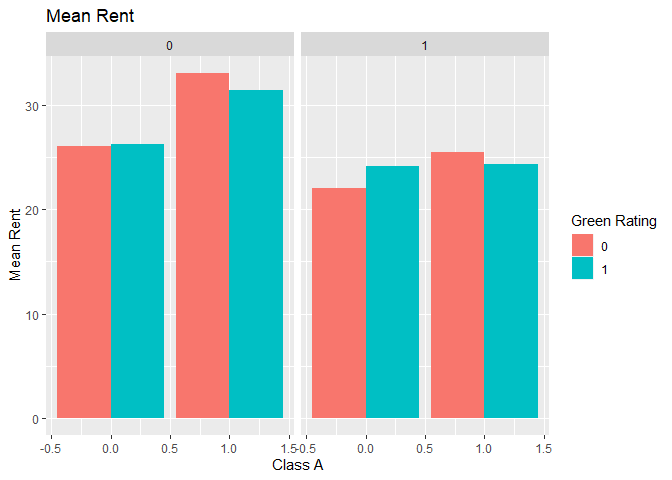

GreenBuildingsQuestion
================

``` r
#load in necessary packages
library(tidyverse)
```

    ## -- Attaching packages ----------------------------------------------- tidyverse 1.2.1 --

    ## v ggplot2 3.2.0     v purrr   0.3.2
    ## v tibble  2.1.3     v dplyr   0.8.3
    ## v tidyr   0.8.3     v stringr 1.4.0
    ## v readr   1.3.1     v forcats 0.4.0

    ## -- Conflicts -------------------------------------------------- tidyverse_conflicts() --
    ## x dplyr::filter() masks stats::filter()
    ## x dplyr::lag()    masks stats::lag()

``` r
library(knitr)
library(ggplot2)
library(dplyr)
```

``` r
#read in data
GB <- read.csv("greenbuildings.csv")
head(GB)
```

    ##   CS_PropertyID cluster   size empl_gr  Rent leasing_rate stories age
    ## 1        379105       1 260300    2.22 38.56        91.39      14  16
    ## 2        122151       1  67861    2.22 28.57        87.14       5  27
    ## 3        379839       1 164848    2.22 33.31        88.94      13  36
    ## 4         94614       1  93372    2.22 35.00        97.04      13  46
    ## 5        379285       1 174307    2.22 40.69        96.58      16   5
    ## 6         94765       1 231633    2.22 43.16        92.74      14  20
    ##   renovated class_a class_b LEED Energystar green_rating net amenities
    ## 1         0       1       0    0          1            1   0         1
    ## 2         0       0       1    0          0            0   0         1
    ## 3         1       0       1    0          0            0   0         1
    ## 4         1       0       1    0          0            0   0         0
    ## 5         0       1       0    0          0            0   0         1
    ## 6         0       1       0    0          0            0   0         1
    ##   cd_total_07 hd_total07 total_dd_07 Precipitation  Gas_Costs
    ## 1        4988         58        5046         42.57 0.01370000
    ## 2        4988         58        5046         42.57 0.01373149
    ## 3        4988         58        5046         42.57 0.01373149
    ## 4        4988         58        5046         42.57 0.01373149
    ## 5        4988         58        5046         42.57 0.01373149
    ## 6        4988         58        5046         42.57 0.01373149
    ##   Electricity_Costs cluster_rent
    ## 1        0.02900000        36.78
    ## 2        0.02904455        36.78
    ## 3        0.02904455        36.78
    ## 4        0.02904455        36.78
    ## 5        0.02904455        36.78
    ## 6        0.02904455        36.78

``` r
names(GB)
```

    ##  [1] "CS_PropertyID"     "cluster"           "size"             
    ##  [4] "empl_gr"           "Rent"              "leasing_rate"     
    ##  [7] "stories"           "age"               "renovated"        
    ## [10] "class_a"           "class_b"           "LEED"             
    ## [13] "Energystar"        "green_rating"      "net"              
    ## [16] "amenities"         "cd_total_07"       "hd_total07"       
    ## [19] "total_dd_07"       "Precipitation"     "Gas_Costs"        
    ## [22] "Electricity_Costs" "cluster_rent"

``` r
GB_higherocc <- subset(GB,  leasing_rate> .1)
#GB_higherocc
```

To be consistent with the "Excel gurus analysis, I created a subset of
the data that only includes properties with leasing rate greater than
10%.

\#\#multivariate linear regression Perform a simple linear regression to
get a better feel of the relationships we’d want to explore visually

``` r
#linear regression including all variables
lm.gb=lm(Rent~., data=GB_higherocc)
summary(lm.gb)
```

    ## 
    ## Call:
    ## lm(formula = Rent ~ ., data = GB_higherocc)
    ## 
    ## Residuals:
    ##     Min      1Q  Median      3Q     Max 
    ## -53.849  -3.571  -0.524   2.484 173.910 
    ## 
    ## Coefficients: (1 not defined because of singularities)
    ##                     Estimate Std. Error t value Pr(>|t|)    
    ## (Intercept)       -8.024e+00  1.071e+00  -7.493 7.51e-14 ***
    ## CS_PropertyID      3.663e-07  1.717e-07   2.133 0.032932 *  
    ## cluster            7.261e-04  2.880e-04   2.521 0.011728 *  
    ## size               6.779e-06  6.608e-07  10.258  < 2e-16 ***
    ## empl_gr            6.368e-02  1.734e-02   3.673 0.000242 ***
    ## leasing_rate       7.141e-03  6.344e-03   1.126 0.260329    
    ## stories           -3.448e-02  1.630e-02  -2.115 0.034445 *  
    ## age               -1.160e-02  4.806e-03  -2.414 0.015782 *  
    ## renovated         -1.611e-01  2.633e-01  -0.612 0.540588    
    ## class_a            2.944e+00  4.469e-01   6.588 4.74e-11 ***
    ## class_b            1.243e+00  3.526e-01   3.526 0.000424 ***
    ## LEED               1.893e+00  3.598e+00   0.526 0.598744    
    ## Energystar        -2.013e-01  3.835e+00  -0.052 0.958149    
    ## green_rating       6.812e-01  3.856e+00   0.177 0.859789    
    ## net               -2.533e+00  5.974e-01  -4.240 2.26e-05 ***
    ## amenities          6.550e-01  2.546e-01   2.573 0.010096 *  
    ## cd_total_07       -1.356e-04  1.487e-04  -0.912 0.361640    
    ## hd_total07         5.067e-04  9.097e-05   5.570 2.63e-08 ***
    ## total_dd_07               NA         NA      NA       NA    
    ## Precipitation      4.634e-02  1.639e-02   2.827 0.004716 ** 
    ## Gas_Costs         -3.542e+02  8.020e+01  -4.416 1.02e-05 ***
    ## Electricity_Costs  1.818e+02  2.528e+01   7.191 7.06e-13 ***
    ## cluster_rent       1.014e+00  1.451e-02  69.939  < 2e-16 ***
    ## ---
    ## Signif. codes:  0 '***' 0.001 '**' 0.01 '*' 0.05 '.' 0.1 ' ' 1
    ## 
    ## Residual standard error: 9.455 on 7639 degrees of freedom
    ##   (73 observations deleted due to missingness)
    ## Multiple R-squared:  0.6108, Adjusted R-squared:  0.6097 
    ## F-statistic: 570.8 on 21 and 7639 DF,  p-value: < 2.2e-16

Interestingly, we see here that whether a building is either LEED- or
EnergyStar-certified is not a statistically significant predictor of
rent. The relationships that may be interesting to investigate would be
building class and whether the rent is quoted on a net contract basis.

\#\#first pass: compare rent for green vs. non-green buildings, holding
nothing
constant

``` r
ggplot(GB_higherocc, aes(x=green_rating, y=Rent, fill= as.factor(green_rating))) + stat_summary(fun.y="mean", geom="bar")
```

<!-- --> We
see that on average that green buildings appear to have higher rents per
square foot. But is this due to the green rating alone or are there
other confounding factors? Let’s examine some of the factors we found to
be signigicant in the linear regression.

\#\#second pass: compare rent for green vs. non-green buildings, holding
class constant

``` r
library(dplyr)

d4 = GB_higherocc %>%
  group_by(green_rating, class_a) %>%
  summarize(mean_rent = mean(Rent))
d4
```

    ## # A tibble: 4 x 3
    ## # Groups:   green_rating [2]
    ##   green_rating class_a mean_rent
    ##          <int>   <int>     <dbl>
    ## 1            0       0      25.9
    ## 2            0       1      32.6
    ## 3            1       0      26.2
    ## 4            1       1      31.0

``` r
ggplot(data = d4) + 
  geom_bar(mapping = aes(x=green_rating, y=mean_rent, fill= as.factor(green_rating)), stat='identity') + facet_wrap(~class_a)
```

<!-- --> Here,
the two predictors of rent being investigated are building class and
whether or not the building has a green rating. We are specifically
looking at Class A buildings, which are the highest quality buildings in
a given market. Buildings flagged as Class A are equal to 1 and Class B
and Class C buildings are equal to 0. Interestingly, we see here on
average that for Class A buildings, green buildings’ rents per square
foot are less than non-green buildings. For Class B and Class C
buildings, green buildings’ rents seem to be slightly higher. So given
the building is high quality, green buildings seem to earn less in rent.

\#\#third pass: compare rent for green vs. non-green buildings, holding
net constant

``` r
d5 = GB_higherocc %>%
  group_by(green_rating, net) %>%
  summarize(mean_rent = mean(Rent))
d5
```

    ## # A tibble: 4 x 3
    ## # Groups:   green_rating [2]
    ##   green_rating   net mean_rent
    ##          <int> <int>     <dbl>
    ## 1            0     0      28.6
    ## 2            0     1      24.3
    ## 3            1     0      30.4
    ## 4            1     1      24.4

``` r
ggplot(data = d5) + 
  geom_bar(mapping = aes(x=green_rating, y=mean_rent, fill= as.factor(green_rating)), stat='identity') + facet_wrap(~net)
```

<!-- --> The
next factor I wanted to examine based on the regression results was
whether the rent is quoted on a “net contract” basis. Tenants with
net-rental contracts pay their own utility costs, which are otherwise
included in the quoted rental price. These properties are flagged in the
dataset with 1. I would have expected that tenants that have to pay for
their own utility costs would be willing to pay a premium to live in a
green building to keep utility costs down, but we see here that’s not
the case. The average rent for places with rents quoted on a net
contract is very similar for green and non-green buildings. Meanwhile,
the green properties that include utilities in rent actually have higher
rents than non-green buildings, whose utility costs should be higher.

\#\#fourth pass: compare rent for green vs. non-green buildings, holding
class and net constant

``` r
GB_higherocc = na.omit(GB_higherocc)

d6 = GB_higherocc %>%
  group_by(green_rating, class_a, net) %>%
  summarize(mean_rent = mean(Rent))
d6
```

    ## # A tibble: 8 x 4
    ## # Groups:   green_rating, class_a [4]
    ##   green_rating class_a   net mean_rent
    ##          <int>   <int> <int>     <dbl>
    ## 1            0       0     0      26.0
    ## 2            0       0     1      22.0
    ## 3            0       1     0      33.1
    ## 4            0       1     1      25.5
    ## 5            1       0     0      26.3
    ## 6            1       0     1      24.2
    ## 7            1       1     0      31.4
    ## 8            1       1     1      24.4

``` r
ggplot(data = d6) + 
  geom_bar(mapping = aes(x=class_a, y=mean_rent, fill=as.factor(green_rating)),
           stat='identity', position ='dodge') + 
  facet_wrap(~net) + 
  labs(title="Mean Rent", 
       y="Mean Rent",
       x = "Class A",
       fill="Green Rating")
```

<!-- --> When
we include green rating, building class, and net on the same plot, we
see that there are very few cases where green building outperform
non-green buildings in terms of average rent per sqaure feet. The only
case where green buildings’ rents are clearly higher than non-green
buildings’ rents is where it is a Class B or C building with a net
contract. The highest rents for green buildings is where it is a Class A
building without a net contract, but here it does not outperform a
non-green building.

\#\#summary In summary, I do not agree with the conclusions of the
on-staff stats guru. I believe he failed to take into account
confounding variables for the relationship between rent and green
status, namely building class and whether or not the property quotes
rent on a net contract basis. From my analysis, non-green buildings
outperform green buildings in nearly every category which makes me
question whether investing in a green building over a non-green building
is truly worth it from an economic perspective. Especially when you
factor in the additional cost of the green certification.
