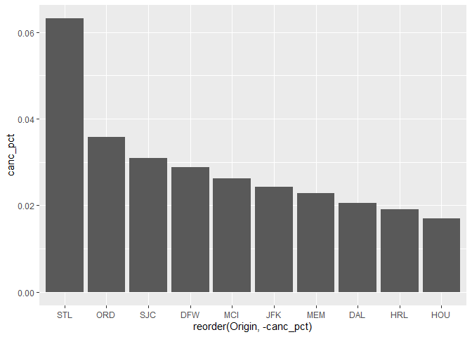
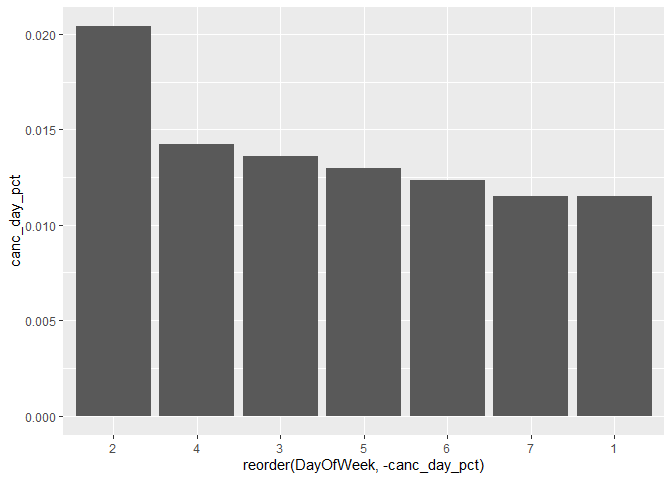
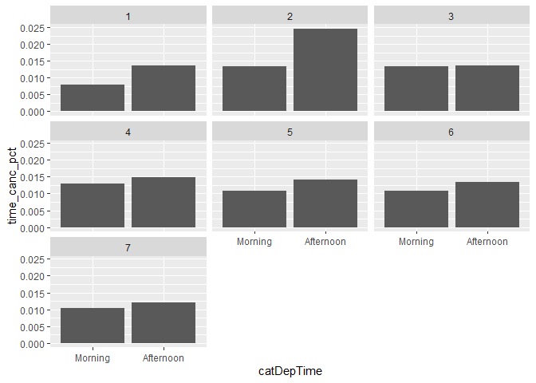
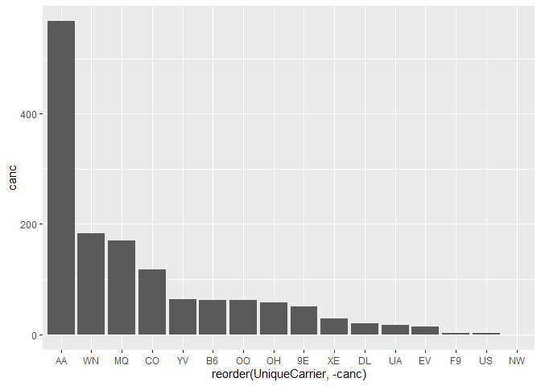
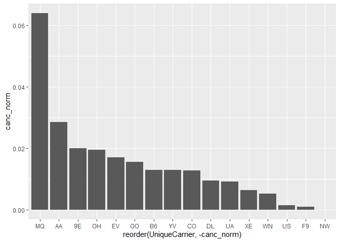

AirportQuestion
================
Shelby Watson
8/14/2019

``` r
#load in necessary packages
library(tidyverse)
```

    ## -- Attaching packages ----------------------------------------------- tidyverse 1.2.1 --

    ## v ggplot2 3.2.0     v purrr   0.3.2
    ## v tibble  2.1.3     v dplyr   0.8.3
    ## v tidyr   0.8.3     v stringr 1.4.0
    ## v readr   1.3.1     v forcats 0.4.0

    ## -- Conflicts -------------------------------------------------- tidyverse_conflicts() --
    ## x dplyr::filter() masks stats::filter()
    ## x dplyr::lag()    masks stats::lag()

``` r
library(knitr)
library(ggplot2)
library(dplyr)
library(plyr)
```

    ## -------------------------------------------------------------------------

    ## You have loaded plyr after dplyr - this is likely to cause problems.
    ## If you need functions from both plyr and dplyr, please load plyr first, then dplyr:
    ## library(plyr); library(dplyr)

    ## -------------------------------------------------------------------------

    ## 
    ## Attaching package: 'plyr'

    ## The following objects are masked from 'package:dplyr':
    ## 
    ##     arrange, count, desc, failwith, id, mutate, rename, summarise,
    ##     summarize

    ## The following object is masked from 'package:purrr':
    ## 
    ##     compact

``` r
#read in data
airdata = read.csv('ABIA.csv')
head(airdata)
```

    ##   Year Month DayofMonth DayOfWeek DepTime CRSDepTime ArrTime CRSArrTime
    ## 1 2008     1          1         2     120       1935     309       2130
    ## 2 2008     1          1         2     555        600     826        835
    ## 3 2008     1          1         2     600        600     728        729
    ## 4 2008     1          1         2     601        605     727        750
    ## 5 2008     1          1         2     601        600     654        700
    ## 6 2008     1          1         2     636        645     934        932
    ##   UniqueCarrier FlightNum TailNum ActualElapsedTime CRSElapsedTime AirTime
    ## 1            9E      5746  84129E               109            115      88
    ## 2            AA      1614  N438AA               151            155     133
    ## 3            YV      2883  N922FJ               148            149     125
    ## 4            9E      5743  89189E                86            105      70
    ## 5            AA      1157  N4XAAA                53             60      38
    ## 6            NW      1674   N967N               178            167     145
    ##   ArrDelay DepDelay Origin Dest Distance TaxiIn TaxiOut Cancelled
    ## 1      339      345    MEM  AUS      559      3      18         0
    ## 2       -9       -5    AUS  ORD      978      7      11         0
    ## 3       -1        0    AUS  PHX      872      7      16         0
    ## 4      -23       -4    AUS  MEM      559      4      12         0
    ## 5       -6        1    AUS  DFW      190      5      10         0
    ## 6        2       -9    AUS  MSP     1042     11      22         0
    ##   CancellationCode Diverted CarrierDelay WeatherDelay NASDelay
    ## 1                         0          339            0        0
    ## 2                         0           NA           NA       NA
    ## 3                         0           NA           NA       NA
    ## 4                         0           NA           NA       NA
    ## 5                         0           NA           NA       NA
    ## 6                         0           NA           NA       NA
    ##   SecurityDelay LateAircraftDelay
    ## 1             0                 0
    ## 2            NA                NA
    ## 3            NA                NA
    ## 4            NA                NA
    ## 5            NA                NA
    ## 6            NA                NA

``` r
attach(airdata)
```

``` r
#create df of just cancelled flights
cancelled = subset(airdata, Cancelled == 1)
head(cancelled)
```

    ##     Year Month DayofMonth DayOfWeek DepTime CRSDepTime ArrTime CRSArrTime
    ## 250 2008     1          1         2      NA        646      NA        922
    ## 251 2008     1          1         2      NA       1740      NA       1835
    ## 252 2008     1          1         2      NA       1525      NA       1625
    ## 253 2008     1          1         2      NA       1915      NA       2015
    ## 254 2008     1          1         2      NA       1620      NA       1710
    ## 255 2008     1          1         2      NA       1735      NA       1835
    ##     UniqueCarrier FlightNum TailNum ActualElapsedTime CRSElapsedTime
    ## 250            OO      5972  N726SK                NA            156
    ## 251            WN      2880                        NA             55
    ## 252            AA      1128                        NA             60
    ## 253            AA      1566                        NA             60
    ## 254            WN      2793                        NA             50
    ## 255            AA       479                        NA             60
    ##     AirTime ArrDelay DepDelay Origin Dest Distance TaxiIn TaxiOut
    ## 250      NA       NA       NA    AUS  ORD      978     NA      NA
    ## 251      NA       NA       NA    AUS  DAL      189     NA      NA
    ## 252      NA       NA       NA    AUS  DFW      190     NA      NA
    ## 253      NA       NA       NA    AUS  DFW      190     NA      NA
    ## 254      NA       NA       NA    DAL  AUS      189     NA      NA
    ## 255      NA       NA       NA    DFW  AUS      190     NA      NA
    ##     Cancelled CancellationCode Diverted CarrierDelay WeatherDelay NASDelay
    ## 250         1                B        0           NA           NA       NA
    ## 251         1                A        0           NA           NA       NA
    ## 252         1                A        0           NA           NA       NA
    ## 253         1                A        0           NA           NA       NA
    ## 254         1                A        0           NA           NA       NA
    ## 255         1                A        0           NA           NA       NA
    ##     SecurityDelay LateAircraftDelay
    ## 250            NA                NA
    ## 251            NA                NA
    ## 252            NA                NA
    ## 253            NA                NA
    ## 254            NA                NA
    ## 255            NA                NA

``` r
#create df of just cancelled flights coming to Austin
inc_cancelled <- subset(cancelled, Origin != "AUS")
head(inc_cancelled)
```

    ##     Year Month DayofMonth DayOfWeek DepTime CRSDepTime ArrTime CRSArrTime
    ## 254 2008     1          1         2      NA       1620      NA       1710
    ## 255 2008     1          1         2      NA       1735      NA       1835
    ## 554 2008     1          2         3      NA       1720      NA       1810
    ## 555 2008     1          2         3      NA       1930      NA       2020
    ## 852 2008     1          3         4      NA       1136      NA       1701
    ## 853 2008     1          3         4      NA       1325      NA       1415
    ##     UniqueCarrier FlightNum TailNum ActualElapsedTime CRSElapsedTime
    ## 254            WN      2793                        NA             50
    ## 255            AA       479                        NA             60
    ## 554            WN       373                        NA             50
    ## 555            MQ      3824                        NA             50
    ## 852            UA       374                        NA            205
    ## 853            WN       112                        NA             50
    ##     AirTime ArrDelay DepDelay Origin Dest Distance TaxiIn TaxiOut
    ## 254      NA       NA       NA    DAL  AUS      189     NA      NA
    ## 255      NA       NA       NA    DFW  AUS      190     NA      NA
    ## 554      NA       NA       NA    DAL  AUS      189     NA      NA
    ## 555      NA       NA       NA    DAL  AUS      189     NA      NA
    ## 852      NA       NA       NA    SFO  AUS     1504     NA      NA
    ## 853      NA       NA       NA    DAL  AUS      189     NA      NA
    ##     Cancelled CancellationCode Diverted CarrierDelay WeatherDelay NASDelay
    ## 254         1                A        0           NA           NA       NA
    ## 255         1                A        0           NA           NA       NA
    ## 554         1                A        0           NA           NA       NA
    ## 555         1                A        0           NA           NA       NA
    ## 852         1                A        0           NA           NA       NA
    ## 853         1                A        0           NA           NA       NA
    ##     SecurityDelay LateAircraftDelay
    ## 254            NA                NA
    ## 255            NA                NA
    ## 554            NA                NA
    ## 555            NA                NA
    ## 852            NA                NA
    ## 853            NA                NA

``` r
#create df of just flights coming to Austin
incoming <- subset(airdata, Origin != "AUS")
head(incoming)
```

    ##    Year Month DayofMonth DayOfWeek DepTime CRSDepTime ArrTime CRSArrTime
    ## 1  2008     1          1         2     120       1935     309       2130
    ## 8  2008     1          1         2     650        700     841        857
    ## 9  2008     1          1         2     650        650    1139       1145
    ## 19 2008     1          1         2     748        755    1007       1020
    ## 20 2008     1          1         2     753        755    1137       1125
    ## 24 2008     1          1         2     811        815    1048       1100
    ##    UniqueCarrier FlightNum TailNum ActualElapsedTime CRSElapsedTime
    ## 1             9E      5746  84129E               109            115
    ## 8             XE       541  N18557               111            117
    ## 9             AA      1182  N4WAAA               169            175
    ## 19            WN        61  N609SW                79             85
    ## 20            B6      1061  N179JB               284            270
    ## 24            AA      1199  N491AA               157            165
    ##    AirTime ArrDelay DepDelay Origin Dest Distance TaxiIn TaxiOut Cancelled
    ## 1       88      339      345    MEM  AUS      559      3      18         0
    ## 8       94      -16      -10    MCI  AUS      650      6      11         0
    ## 9      153       -6        0    LAX  AUS     1242      4      12         0
    ## 19      68      -13       -7    ELP  AUS      528      3       8         0
    ## 20     257       12       -2    JFK  AUS     1522      4      23         0
    ## 24     139      -12       -4    ORD  AUS      978      4      14         0
    ##    CancellationCode Diverted CarrierDelay WeatherDelay NASDelay
    ## 1                          0          339            0        0
    ## 8                          0           NA           NA       NA
    ## 9                          0           NA           NA       NA
    ## 19                         0           NA           NA       NA
    ## 20                         0           NA           NA       NA
    ## 24                         0           NA           NA       NA
    ##    SecurityDelay LateAircraftDelay
    ## 1              0                 0
    ## 8             NA                NA
    ## 9             NA                NA
    ## 19            NA                NA
    ## 20            NA                NA
    ## 24            NA                NA

``` r
#group flights by origin and summarize by the percentage of flights from that origin that are cancelled
#then only include the origins with the 10 highest percentage of cancelled flights
d1 = incoming %>%
  group_by(Origin) %>%
  dplyr :: summarize(canc_pct = sum(Cancelled==1)/n())%>% 
  arrange(desc(canc_pct))%>% 
  slice(1:10)
d1
```

    ## # A tibble: 10 x 2
    ##    Origin canc_pct
    ##    <fct>     <dbl>
    ##  1 STL      0.0632
    ##  2 ORD      0.0358
    ##  3 SJC      0.0310
    ##  4 DFW      0.0289
    ##  5 MCI      0.0261
    ##  6 JFK      0.0243
    ##  7 MEM      0.0228
    ##  8 DAL      0.0206
    ##  9 HRL      0.0191
    ## 10 HOU      0.0169

``` r
#plot origin vs. cancelled percentage in descending order
ggplot(data = d1, aes(x=reorder(Origin,-canc_pct), y=canc_pct)) + 
geom_bar(stat='identity')
```

<!-- -->

Here, we’ve plotted the top 10 origins with the most cancellations, only
including incoming flights to Austin. St. Louis Lambert International
Airport has the highest portion of cancellations of all the origin
locations.

``` r
# plot the percentage of total cancellations per day in descending order
d2 = incoming %>%
  group_by(DayOfWeek) %>%
  dplyr :: summarize(canc_day_pct = sum(Cancelled==1)/n()) 
d2
```

    ## # A tibble: 7 x 2
    ##   DayOfWeek canc_day_pct
    ##       <int>        <dbl>
    ## 1         1       0.0115
    ## 2         2       0.0204
    ## 3         3       0.0136
    ## 4         4       0.0142
    ## 5         5       0.0130
    ## 6         6       0.0123
    ## 7         7       0.0115

``` r
#plot day of week vs. cancelled percentage in descending order
ggplot(data = d2, aes(x=reorder(DayOfWeek,-canc_day_pct), y=canc_day_pct)) + 
geom_bar(stat='identity')
```

<!-- -->

When we plot cancellations by day, we see that the most cancellations
are on Tuesdays.

``` r
#create catgorical varaible for time of day
incoming$catDepTime = cut(incoming$CRSDepTime, breaks=c(1,1200,2400), labels=c("Morning","Afternoon"))

incoming$catDepTime[1:10]
```

    ##  [1] Afternoon Morning   Morning   Morning   Morning   Morning   Morning  
    ##  [8] Morning   Morning   Morning  
    ## Levels: Morning Afternoon

``` r
#plotting the days and times of day when most cancellation occur
d3 = incoming %>%
  group_by(DayOfWeek, catDepTime) %>%
  dplyr :: summarize(time_canc_pct = sum(Cancelled==1)/n())
d3
```

    ## # A tibble: 14 x 3
    ## # Groups:   DayOfWeek [7]
    ##    DayOfWeek catDepTime time_canc_pct
    ##        <int> <fct>              <dbl>
    ##  1         1 Morning          0.00796
    ##  2         1 Afternoon        0.0136 
    ##  3         2 Morning          0.0134 
    ##  4         2 Afternoon        0.0246 
    ##  5         3 Morning          0.0134 
    ##  6         3 Afternoon        0.0137 
    ##  7         4 Morning          0.0130 
    ##  8         4 Afternoon        0.0149 
    ##  9         5 Morning          0.0109 
    ## 10         5 Afternoon        0.0142 
    ## 11         6 Morning          0.0108 
    ## 12         6 Afternoon        0.0133 
    ## 13         7 Morning          0.0103 
    ## 14         7 Afternoon        0.0121

``` r
ggplot(data = d3) + 
  geom_bar(mapping = aes(x=catDepTime, y=time_canc_pct), stat='identity') + facet_wrap(~DayOfWeek)
```

<!-- -->

When we plot cancellations by day and time of day, we see that most of
the cancellations occur on Tuesday afternoons.

``` r
canc_carrier = airdata %>%
 group_by(UniqueCarrier) %>%
 dplyr :: summarize(canc = sum(Cancelled==1))
canc_carrier
```

    ## # A tibble: 16 x 2
    ##    UniqueCarrier  canc
    ##    <fct>         <int>
    ##  1 9E               51
    ##  2 AA              568
    ##  3 B6               62
    ##  4 CO              118
    ##  5 DL               20
    ##  6 EV               14
    ##  7 F9                2
    ##  8 MQ              170
    ##  9 NW                0
    ## 10 OH               58
    ## 11 OO               62
    ## 12 UA               17
    ## 13 US                2
    ## 14 WN              183
    ## 15 XE               29
    ## 16 YV               64

``` r
#plot(norm_canc, las = 2)
ggplot(data = canc_carrier, aes(x=reorder(UniqueCarrier,-canc), y=canc)) +
geom_bar(stat='identity')
```

<!-- -->

From this plot, we see that the carrier with the highest number of
cancellations is AA. However, this doesn’t mean much in context. Let’s
normalize to see who performs the best and worst in terms of
cancellation.

``` r
norm_canc = airdata %>%
 group_by(UniqueCarrier) %>%
 dplyr :: summarize(canc_norm = sum(Cancelled==1)/n())
norm_canc
```

    ## # A tibble: 16 x 2
    ##    UniqueCarrier canc_norm
    ##    <fct>             <dbl>
    ##  1 9E             0.0200  
    ##  2 AA             0.0284  
    ##  3 B6             0.0129  
    ##  4 CO             0.0128  
    ##  5 DL             0.00937 
    ##  6 EV             0.0170  
    ##  7 F9             0.000938
    ##  8 MQ             0.0638  
    ##  9 NW             0       
    ## 10 OH             0.0194  
    ## 11 OO             0.0154  
    ## 12 UA             0.00911 
    ## 13 US             0.00137 
    ## 14 WN             0.00525 
    ## 15 XE             0.00628 
    ## 16 YV             0.0128

``` r
ggplot(data = norm_canc, aes(x=reorder(UniqueCarrier,-canc_norm), y=canc_norm)) +
geom_bar(stat='identity')
```

<!-- -->

Here, we see that MQ actually ended up performing the worst when
normalized, and AA wasn’t actually too bad.
